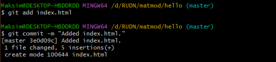

---
## Front matter
lang: ru-RU
title: Лабораторная работа №1
subtitle: Работа с Git
author:
  - Хватов М.Г.
institute:
  - Российский университет дружбы народов, Москва, Россия

## i18n babel
babel-lang: russian
babel-otherlangs: english

## Formatting pdf
toc: false
toc-title: Содержание
slide_level: 2
aspectratio: 169
section-titles: true
theme: metropolis
header-includes:
 - \metroset{progressbar=frametitle,sectionpage=progressbar,numbering=fraction}
 - '\makeatletter'
 - '\beamer@ignorenonframefalse'
 - '\makeatother'
---

# Информация

## Докладчик

:::::::::::::: {.columns align=center}
::: {.column width="70%"}

  * Хватов Максим Григорьевич
  * студент
  * Российский университет дружбы народов
  * [1032204364@pfur.ru](mailto:1032204364@pfur.ru)

:::
::: {.column width="25%"}

:::
::::::::::::::

## Цель работы

Приобрести практические навыки работы с системой управления версиями Git.

## Задания

1. Создать репозиторий

2. Изменить его содержимое, изучить работу с коммитами, версиями и тегами

3. Поработать с объектами Git

4. Создать дополнительную ветку, провести слияние, разрешение конфликтов

5. Создать клон репозитория и слить его с оригинальным

6. Залить и извлечь изменения

# Выполнение лабораторной работы

## Подготовка

# Выполнение лабораторной работы

{#fig:002 width=70%}

## Выполнение лабораторной работы

{#fig:001 width=70%}

## Выполнение лабораторной работы

{#fig:003 width=70%}

## Выполнение лабораторной работы

{#fig:004 width=70%}

## Выполнение лабораторной работы

{#fig:002 width=70%}

## Выполнение лабораторной работы

{#fig:002 width=70%}

## Выполнение лабораторной работы

{#fig:010 width=70%}

## Выполнение лабораторной работы

{#fig:011 width=70%}

## Выполнение лабораторной работы

{#fig:012 width=70%}

## Выполнение лабораторной работы

{#fig:013 width=70%}

## Выполнение лабораторной работы

{#fig:014 width=70%}

## Выполнение лабораторной работы

{#fig:015 width=70%}

## Выполнение лабораторной работы

{#fig:016 width=70%}

## Выполнение лабораторной работы

{#fig:017 width=70%}

## Выполнение лабораторной работы

{#fig:018 width=70%}

## Выполнение лабораторной работы

{#fig:019 width=70%}

## Выполнение лабораторной работы

{#fig:019 width=70%}

## Выполнение лабораторной работы

{#fig:020 width=70%}

## Выполнение лабораторной работы

{#fig:021 width=70%}

## Выполнение лабораторной работы

{#fig:022 width=70%}

## Выполнение лабораторной работы

{#fig:023 width=70%}

# Выполнение лабораторной работы

{#fig:024 width=70%}

## Выполнение лабораторной работы

{#fig:025 width=70%}

## Выполнение лабораторной работы

{#fig:026 width=70%}

## Выполнение лабораторной работы

{#fig:027 width=70%}

## Выполнение лабораторной работы

{#fig:028 width=70%}

## Выполнение лабораторной работы

{#fig:029 width=70%}

## Выполнение лабораторной работы

{#fig:030 width=70%}

## Выполнение лабораторной работы

{#fig:031 width=70%}

## Выполнение лабораторной работы

{#fig:032 width=70%}

## Выполнение лабораторной работы

{#fig:033 width=70%}

## Выполнение лабораторной работы

{#fig:034 width=70%}

## Выполнение лабораторной работы

{#fig:035 width=70%}

## Выполнение лабораторной работы

{#fig:036 width=70%}

# Выводы

В процессе выполнения данной лабораторной работы я приобрела практические навыки работы с Git.