---
## Front matter
title: "Лабораторная работа №1"
subtitle: "Работа с git"
author: "Хватов Максим Григорьевич"

## Generic otions
lang: ru-RU
toc-title: "Содержание"

## Bibliography
bibliography: bib/cite.bib
csl: pandoc/csl/gost-r-7-0-5-2008-numeric.csl

## Pdf output format
toc: true # Table of contents
toc-depth: 2
lof: true # List of figures
lot: false # List of tables
fontsize: 12pt
linestretch: 1.5
papersize: a4
documentclass: scrreprt
## I18n polyglossia
polyglossia-lang:
  name: russian
  options:
	- spelling=modern
	- babelshorthands=true
polyglossia-otherlangs:
  name: english
## I18n babel
babel-lang: russian
babel-otherlangs: english
## Fonts
mainfont: PT Serif
romanfont: PT Serif
sansfont: PT Sans
monofont: PT Mono
mainfontoptions: Ligatures=TeX
romanfontoptions: Ligatures=TeX
sansfontoptions: Ligatures=TeX,Scale=MatchLowercase
monofontoptions: Scale=MatchLowercase,Scale=0.9
## Biblatex
biblatex: true
biblio-style: "gost-numeric"
biblatexoptions:
  - parentracker=true
  - backend=biber
  - hyperref=auto
  - language=auto
  - autolang=other*
  - citestyle=gost-numeric
## Pandoc-crossref LaTeX customization
figureTitle: "Рис."
tableTitle: "Таблица"
listingTitle: "Листинг"
lofTitle: "Список иллюстраций"
lotTitle: "Список таблиц"
lolTitle: "Листинги"
## Misc options
indent: true
header-includes:
  - \usepackage{indentfirst}
  - \usepackage{float} # keep figures where there are in the text
  - \floatplacement{figure}{H} # keep figures where there are in the text
---

# Цель работы

Приобрести практические навыки работы с системой управления версиями Git.

# Теоретическое введение

Git — распределённая система управления версиями. Проект был создан Линусом Торвальдсом для управления разработкой ядра Linux, первая версия выпущена 7 апреля 2005 года; координатор — Дзюн Хамано [@wiki:bash].

# Выполнение лабораторной работы

## Подготовка

Сначала настроим core.autocrlf с параметрами true и input, чтобы сделать все переводы строк текстовых файлов в главном репозитории одинаковыми, а затем настроим отображение unicode(рис. @fig:002).

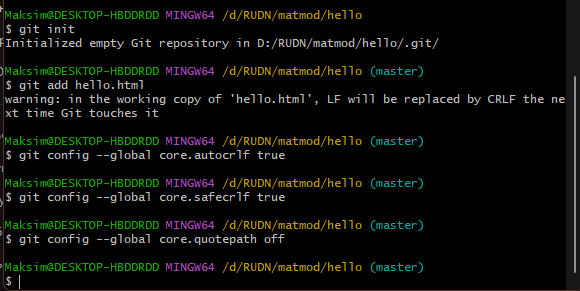{#fig:002 width=70%}

Далее создаю директорию, в которой будет проходить вся работа

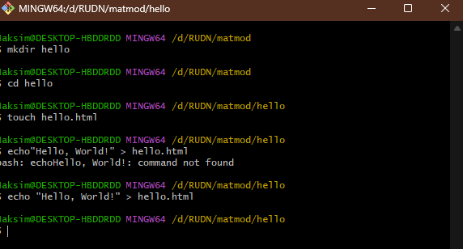{#fig:001 width=70%}

Делаю первый коммит и просматриваю статус 

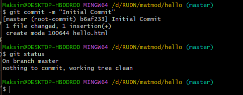{#fig:003 width=70%}

Вношу изменения в hello.html и просматриваю статус

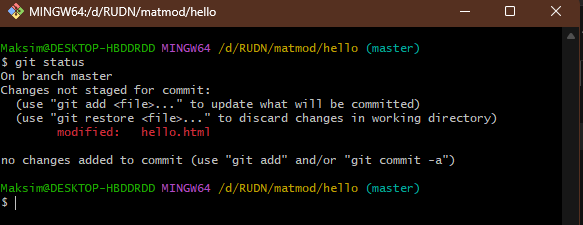{#fig:004 width=70%}

Добавляю измененный файл в индексацию

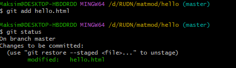{#fig:002 width=70%}
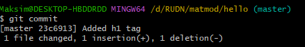{#fig:002 width=70%}

 Вношу другие изменения в файл hello.html и снова просматриваю его статус через команду gitt status

Просматриваю историю коммитов с помощью git log

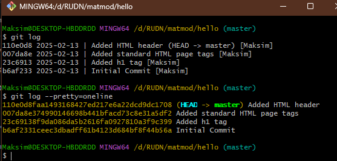{#fig:010 width=70%}

Переклчаюсь на коммит по его номеру хэша

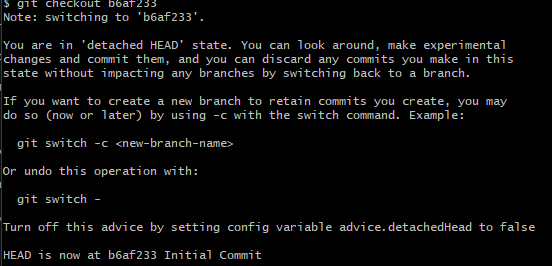{#fig:011 width=70%}

Переключаюсьна ветку мастер и просматриваю содержимое файла

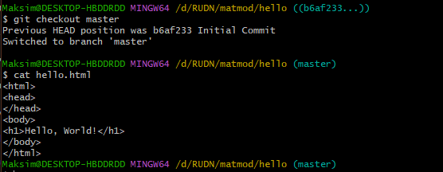{#fig:012 width=70%}

Создаю тэг v1 и v1-beta и переключаюсь между ними. Также просматриваю список тегов и логи коммитов, где указаны также тэги

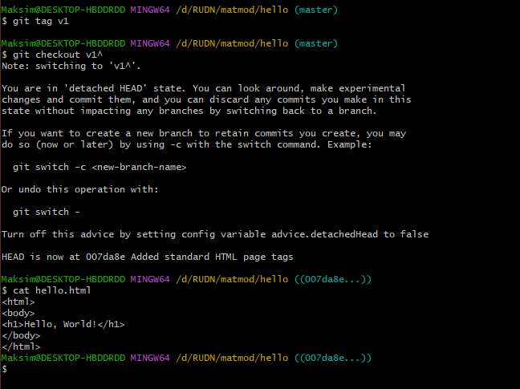{#fig:013 width=70%}
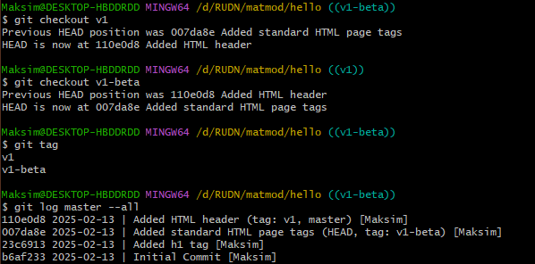{#fig:014 width=70%}
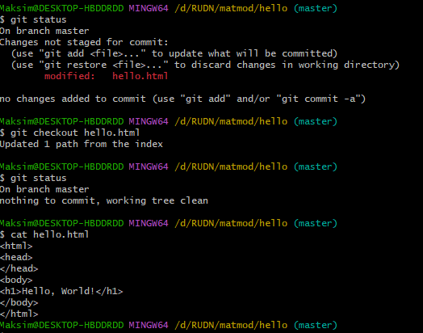{#fig:015 width=70%}

Сделал Сброс к коммиту с помощью reset и revert

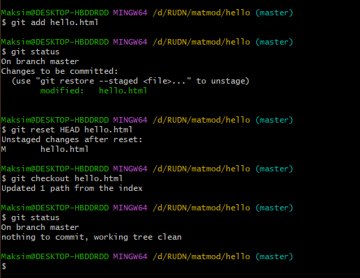{#fig:016 width=70%}
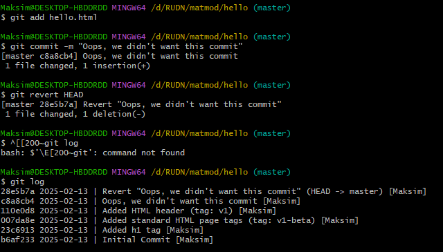{#fig:017 width=70%}
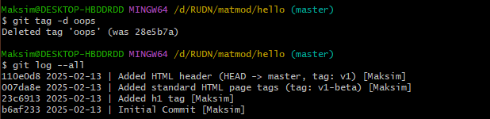{#fig:018 width=70%}
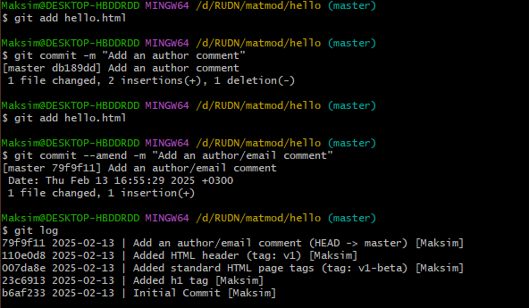{#fig:019 width=70%}
{#fig:019 width=70%}
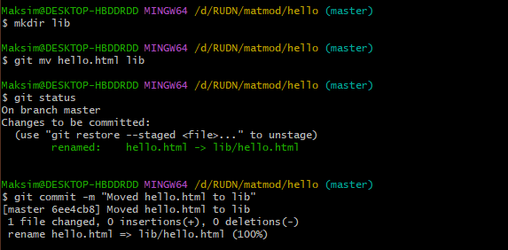{#fig:020 width=70%}
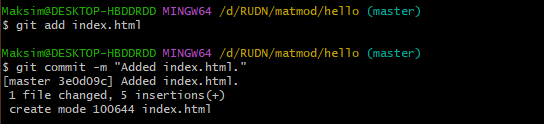{#fig:021 width=70%}
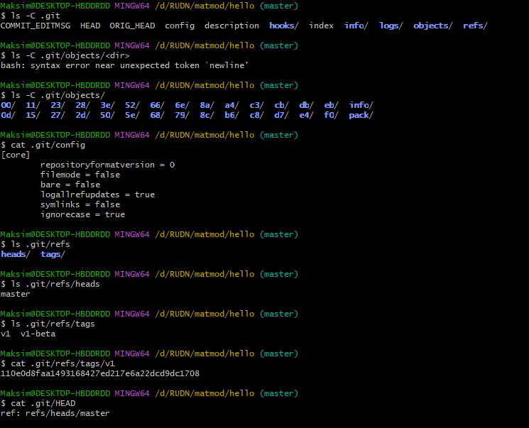{#fig:022 width=70%}
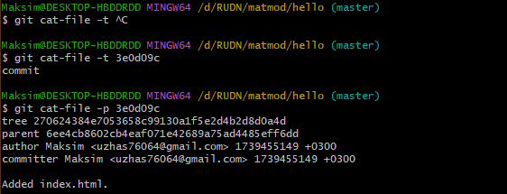{#fig:023 width=70%}
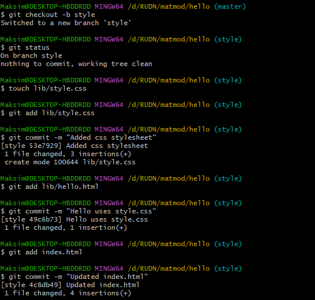{#fig:024 width=70%}
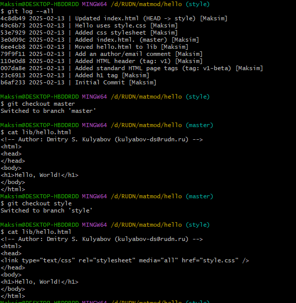{#fig:025 width=70%}
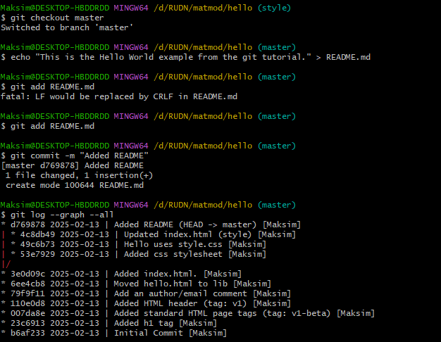{#fig:026 width=70%}
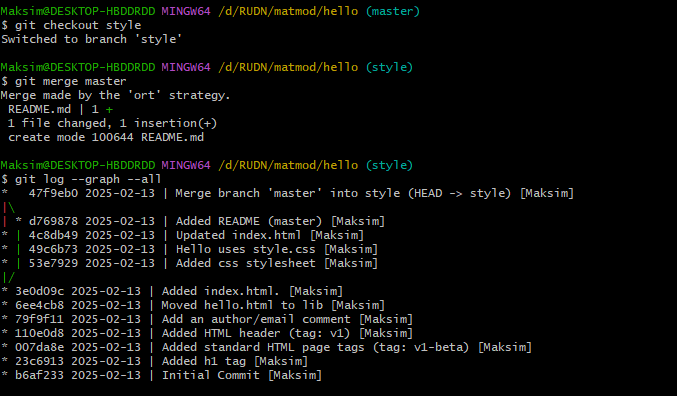{#fig:027 width=70%}
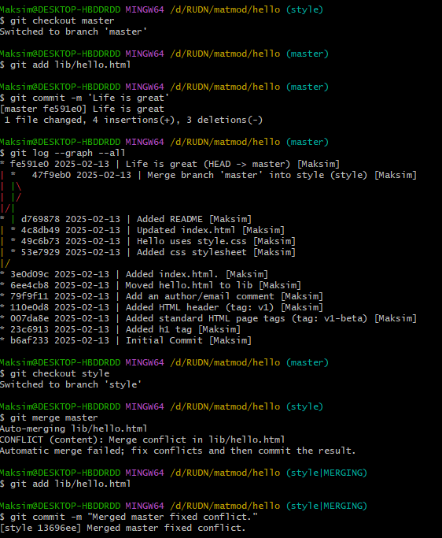{#fig:028 width=70%}
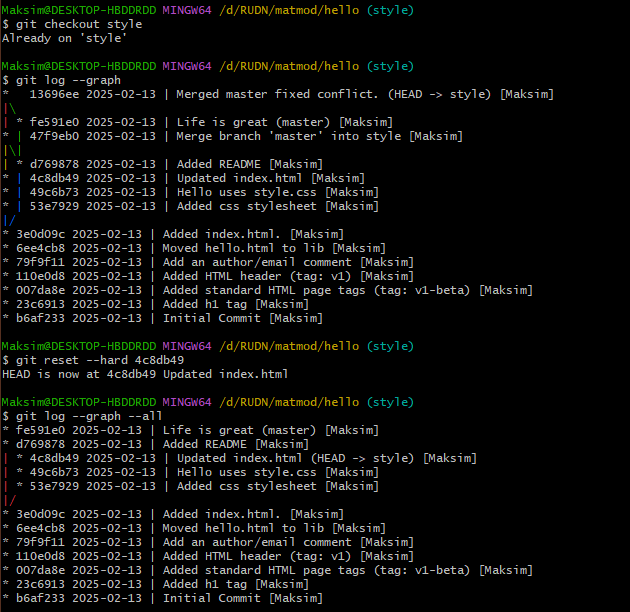{#fig:029 width=70%}
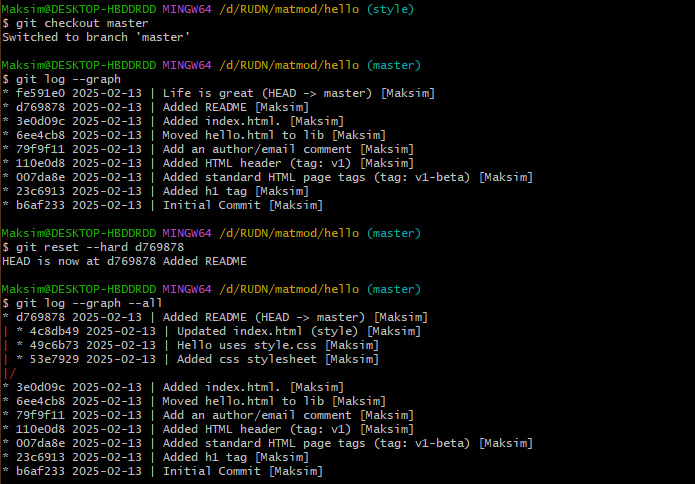{#fig:030 width=70%}
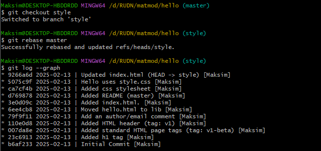{#fig:031 width=70%}
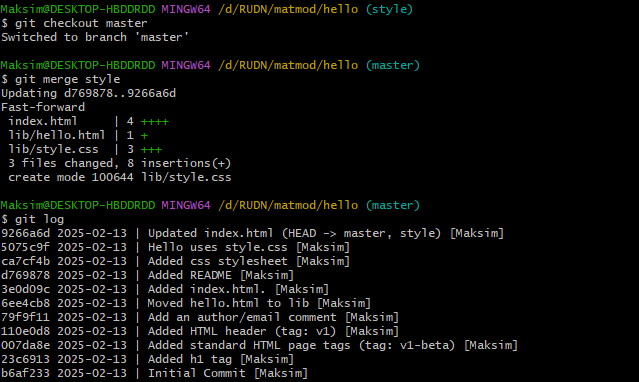{#fig:032 width=70%}
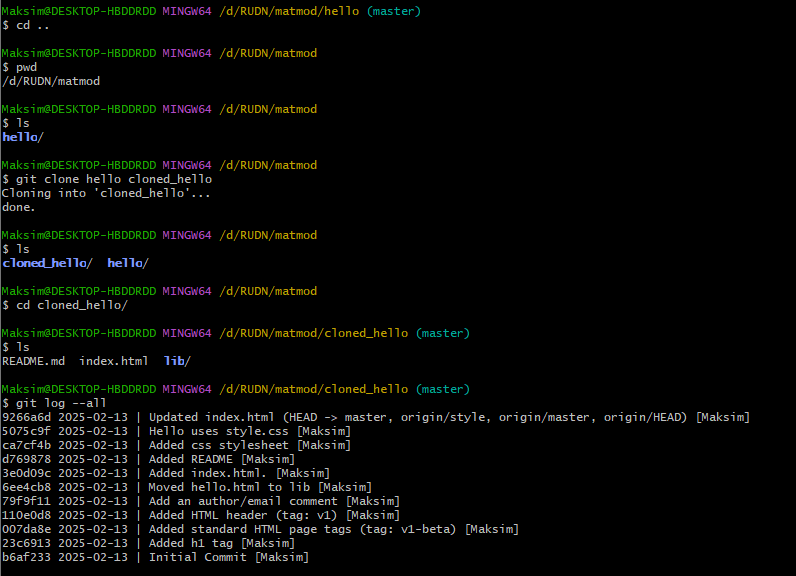{#fig:033 width=70%}
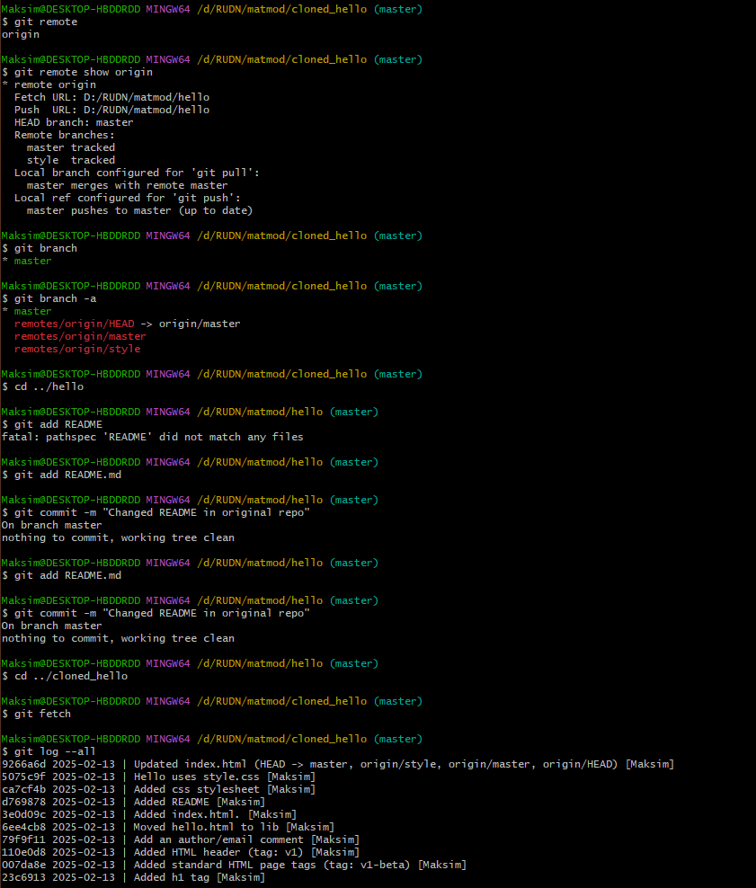{#fig:034 width=70%}
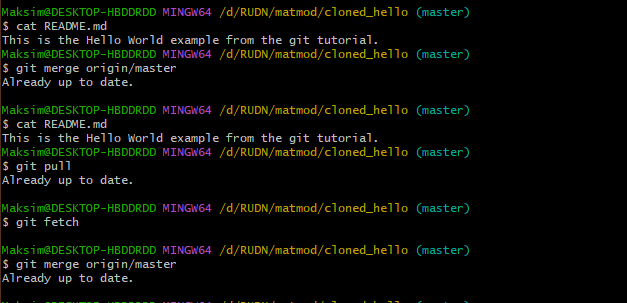{#fig:035 width=70%}
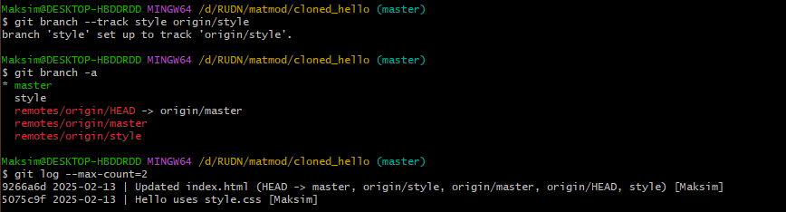{#fig:036 width=70%}

# Выводы

В процессе выполнения данной лабораторной работы я приобрел практические навыки работы с Git.

# Список литературы{.unnumbered}

::: {#refs}
:::