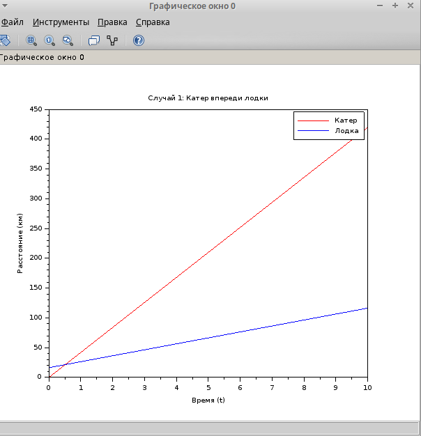
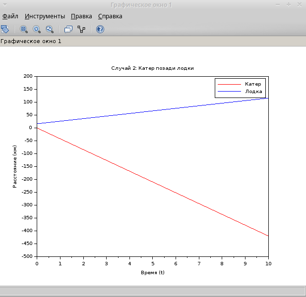
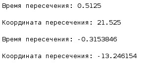

---
## Front matter
lang: ru-RU
title: Лабораторная работа №2
subtitle: Задача 45
author:
  - Хватов М.Г.
institute:
  - Российский университет дружбы народов, Москва, Россия

## i18n babel
babel-lang: russian
babel-otherlangs: english

## Formatting pdf
toc: false
toc-title: Содержание
slide_level: 2
aspectratio: 169
section-titles: true
theme: metropolis
header-includes:
 - \metroset{progressbar=frametitle,sectionpage=progressbar,numbering=fraction}
 - '\makeatletter'
 - '\beamer@ignorenonframefalse'
 - '\makeatother'
---

# Информация

## Докладчик

:::::::::::::: {.columns align=center}
::: {.column width="70%"}

  * Хватов Максим Григорьевич
  * студент
  * Российский университет дружбы народов
  * [1032204364@pfur.ru](mailto:1032204364@pfur.ru)

:::
::: {.column width="25%"}


:::
::::::::::::::


## Цель работы

Приобрести практические навыки работы с scilabпо решению математических задач моделирования

## Задания

На море в тумане катер береговой охраны преследует лодку браконьеров. Через определенный промежуток времени туман рассеивается, и лодка обнаруживается на расстоянии 16,4 км от катера. Затем лодка снова скрывается в тумане и уходит прямолинейно в неизвестном направлении. Известно, что скорость катера в 4,2 раза больше скорости браконьерской лодки.
1. Запишите уравнение, описывающее движение катера, с начальными
условиями для двух случаев (в зависимости от расположения катера
относительно лодки в начальный момент времени).
2. Постройте траекторию движения катера и лодки для двух случаев.
3. Найдите точку пересечения траектории катера и лодки

# Выполнение лабораторной работы

```
// Параметры задачи
v = 10; // Скорость лодки (можно выбрать любое значение)
x_c0 = 0; // Начальное положение катера
x_b0 = 16.4; // Начальное положение лодки

// Время
t = 0:0.1:10; // Временной интервал

// Случай 1: Катер впереди лодки
x_c1 = x_c0 + 4.2 * v * t;
x_b1 = x_b0 + v * t;

// Случай 2: Катер позади лодки
x_c2 = x_c0 - 4.2 * v * t;
x_b2 = x_b0 + v * t;

// Построение графиков
scf(0);
plot(t, x_c1, 'r', t, x_b1, 'b');
xlabel('Время (t)');
ylabel('Расстояние (км)');
title('Случай 1: Катер впереди лодки');
legend(['Катер'; 'Лодка']);

scf(1);
plot(t, x_c2, 'r', t, x_b2, 'b');
xlabel('Время (t)');
ylabel('Расстояние (км)');
title('Случай 2: Катер позади лодки');
legend(['Катер'; 'Лодка']);

// Вычисление времени пересечения для Случая 1
t_intersect = 16.4 / (3.2 * v);
x_intersect = x_c0 + 4.2 * v * t_intersect;

disp("Время пересечения: " + string(t_intersect));
disp("Координата пересечения: " + string(x_intersect));
```

# Выполнение лабораторной работы

{#fig:001 width=70%}

# Выполнение лабораторной работы

{#fig:002 width=70%}

# Выполнение лабораторной работы

{#fig:003 width=70%}

# Выводы

В процессе выполнения лабораторной работы я приобрел практические навыки по решению задач математического моделироваания в scilab