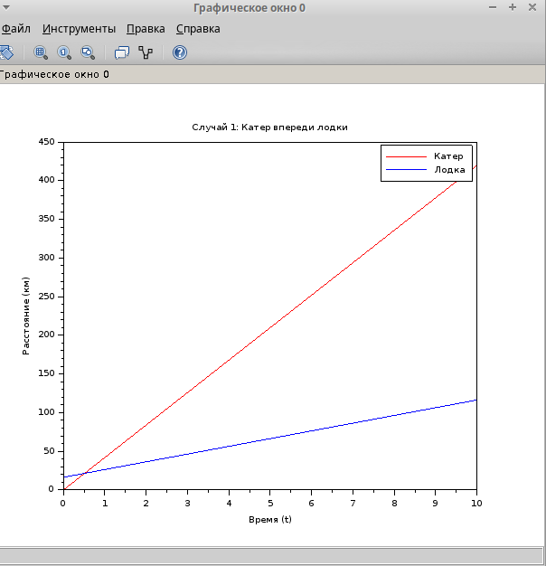
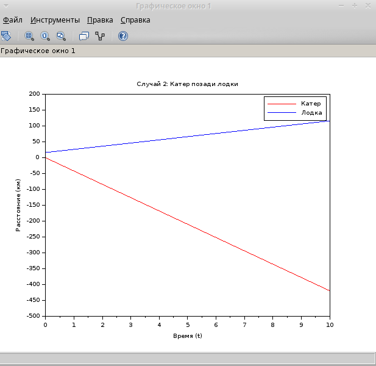

---
## Front matter
title: "Лабораторная работа №2"
subtitle: "Задача 45"
author: "Хватов Максим Григорьевич"

## Generic otions
lang: ru-RU
toc-title: "Содержание"

## Bibliography
bibliography: bib/cite.bib
csl: pandoc/csl/gost-r-7-0-5-2008-numeric.csl

## Pdf output format
toc: true # Table of contents
toc-depth: 2
lof: true # List of figures
lot: false # List of tables
fontsize: 12pt
linestretch: 1.5
papersize: a4
documentclass: scrreprt
## I18n polyglossia
polyglossia-lang:
  name: russian
  options:
	- spelling=modern
	- babelshorthands=true
polyglossia-otherlangs:
  name: english
## I18n babel
babel-lang: russian
babel-otherlangs: english
## Fonts
mainfont: PT Serif
romanfont: PT Serif
sansfont: PT Sans
monofont: PT Mono
mainfontoptions: Ligatures=TeX
romanfontoptions: Ligatures=TeX
sansfontoptions: Ligatures=TeX,Scale=MatchLowercase
monofontoptions: Scale=MatchLowercase,Scale=0.9
## Biblatex
biblatex: true
biblio-style: "gost-numeric"
biblatexoptions:
  - parentracker=true
  - backend=biber
  - hyperref=auto
  - language=auto
  - autolang=other*
  - citestyle=gost-numeric
## Pandoc-crossref LaTeX customization
figureTitle: "Рис."
tableTitle: "Таблица"
listingTitle: "Листинг"
lofTitle: "Список иллюстраций"
lotTitle: "Список таблиц"
lolTitle: "Листинги"
## Misc options
indent: true
header-includes:
  - \usepackage{indentfirst}
  - \usepackage{float} # keep figures where there are in the text
  - \floatplacement{figure}{H} # keep figures where there are in the text
---

# Цель работы

Приобрести практические навыки работы с scilabпо решению математических задач моделирования

# Задание

На море в тумане катер береговой охраны преследует лодку браконьеров. Через определенный промежуток времени туман рассеивается, и лодка обнаруживается на расстоянии 16,4 км от катера. Затем лодка снова скрывается в тумане и уходит прямолинейно в неизвестном направлении. Известно, что скорость катера в 4,2 раза больше скорости браконьерской лодки.
1. Запишите уравнение, описывающее движение катера, с начальными
условиями для двух случаев (в зависимости от расположения катера
относительно лодки в начальный момент времени).
2. Постройте траекторию движения катера и лодки для двух случаев.
3. Найдите точку пересечения траектории катера и лодки

# Выполнение лабораторной работы

Сначала я зайду в scilab и создам новый файл, где буду прописывать исходный код программы, которая будет решатьзадачу из варианта 45.

Исхоный кодимеет следующий вид:

```
// Параметры задачи
v = 10; // Скорость лодки (можно выбрать любое значение)
x_c0 = 0; // Начальное положение катера
x_b0 = 16.4; // Начальное положение лодки

// Время
t = 0:0.1:10; // Временной интервал

// Случай 1: Катер впереди лодки
x_c1 = x_c0 + 4.2 * v * t;
x_b1 = x_b0 + v * t;

// Случай 2: Катер позади лодки
x_c2 = x_c0 - 4.2 * v * t;
x_b2 = x_b0 + v * t;

// Построение графиков
scf(0);
plot(t, x_c1, 'r', t, x_b1, 'b');
xlabel('Время (t)');
ylabel('Расстояние (км)');
title('Случай 1: Катер впереди лодки');
legend(['Катер'; 'Лодка']);

scf(1);
plot(t, x_c2, 'r', t, x_b2, 'b');
xlabel('Время (t)');
ylabel('Расстояние (км)');
title('Случай 2: Катер позади лодки');
legend(['Катер'; 'Лодка']);

// Вычисление времени пересечения для Случая 1
t_intersect = 16.4 / (3.2 * v);
x_intersect = x_c0 + 4.2 * v * t_intersect;

disp("Время пересечения: " + string(t_intersect));
disp("Координата пересечения: " + string(x_intersect));
```

В результате запуска кода, получаются следующие графики для случая, когда лодка позади катера (рис. [-@fig:001]) и лодка впереди катера (рис. [-@fig:002])

{#fig:001 width=70%}

{#fig:002 width=70%}

# Выводы

В процессе выполнения лабораторной работы я приобрел практические навыки по решению задач математического моделироваания в scilab