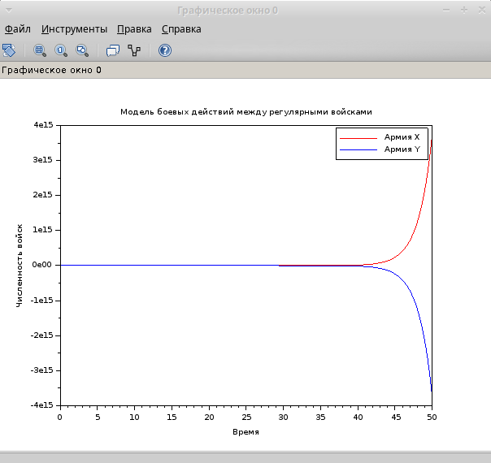
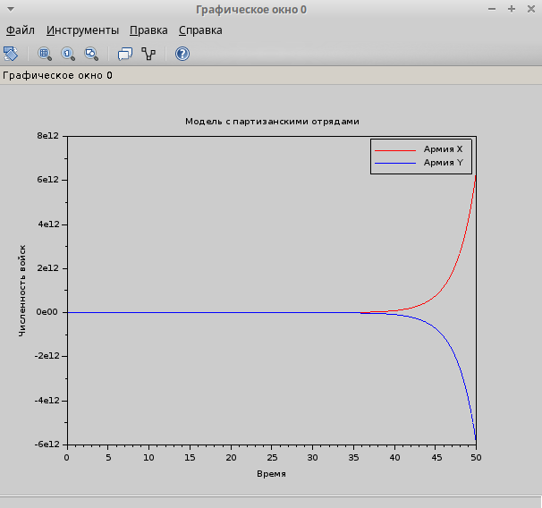

---
## Front matter
lang: ru-RU
title: Лабораторная работа №3
subtitle: Задача 45
author:
  - Хватов М.Г.
institute:
  - Российский университет дружбы народов, Москва, Россия

## i18n babel
babel-lang: russian
babel-otherlangs: english

## Formatting pdf
toc: false
toc-title: Содержание
slide_level: 2
aspectratio: 169
section-titles: true
theme: metropolis
header-includes:
 - \metroset{progressbar=frametitle,sectionpage=progressbar,numbering=fraction}
 - '\makeatletter'
 - '\beamer@ignorenonframefalse'
 - '\makeatother'
---

# Информация

## Докладчик

:::::::::::::: {.columns align=center}
::: {.column width="70%"}

  * Хватов Максим Григорьевич
  * студент
  * Российский университет дружбы народов
  * [1032204364@pfur.ru](mailto:1032204364@pfur.ru)

:::
::: {.column width="25%"}


:::
::::::::::::::


## Цель работы

Приобрести практические навыки работы с scilab по решению математических задач моделирования боевых действий с различными видами войск

## Задания

Между страной Х и страной У идет война. Численность состава войск
исчисляется от начала войны, и являются временными функциями
x(t) и y(t). В начальный момент времени страна Х имеет армию численностью 22 222 человек, а
в распоряжении страны У армия численностью в 11 111 человек. Для упрощения
модели считаем, что коэффициенты a b c h постоянны. Также считаем P(t) и Q(t) непрерывные функции.
Постройте графики изменения численности войск армии Х и армии У для
следующих случаев:
1. Модель боевых действий между регулярными войсками
2. Модель ведение боевых действий с участием регулярных войск и партизанских отрядов

# Выполнение лабораторной работы

```julia
function dy = model1(t, y)
    dy = zeros(2, 1);
    dy(1) = -0.22 * y(1) - 0.77 * y(2) + sin(0.5 * t);
    dy(2) = -0.66 * y(1) - 0.11 * y(2) + cos(0.5 * t);
endfunction
```

# Выполнение лабораторной работы

```julia
function dy = model2(t, y)
    dy = zeros(2, 1);
    dy(1) = -0.31 * y(1) - 0.79 * y(2) + sin(2.5 * t);
    dy(2) = -0.59 * y(1) - 0.21 * y(2) + cos(2 * t);
endfunction
```

# Выполнение лабораторной работы

```julia
// Начальные условия
x0 = [22222; 11111];
t0 = 0; // Начальное время
tmax = 50; // Время моделирования
dt = 0.01; // Уменьшенный шаг интегрирования для стабильности
t = t0:dt:tmax;
```

# Выполнение лабораторной работы

```julia
// Решение первой модели
y = ode(x0, t0, t, model1); // Убрано "rk45", так как Scilab использует другой формат
plot(t, y(1,:), 'r', t, y(2,:), 'b')
xlabel("Время")
ylabel("Численность войск")
title("Модель боевых действий между регулярными войсками")
legend("Армия X", "Армия Y")
grid()
```

# Выполнение лабораторной работы
```julia
// Решение второй модели
y = ode(x0, t0, t, model2);
figure()
plot(t, y(1,:), 'r', t, y(2,:), 'b')
xlabel("Время")
ylabel("Численность войск")
title("Модель с партизанскими отрядами")
legend("Армия X", "Армия Y")
grid()
```

# Выполнение лабораторной работы

{#fig:001 width=70%}

# Выполнение лабораторной работы

{#fig:002 width=70%}

# Выводы

В процессе выполнения лабораторной работы я получил практические навыки работы с scilab по решению математических задач моделирования боевых действий с различными видами войск
