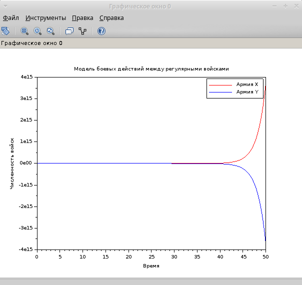
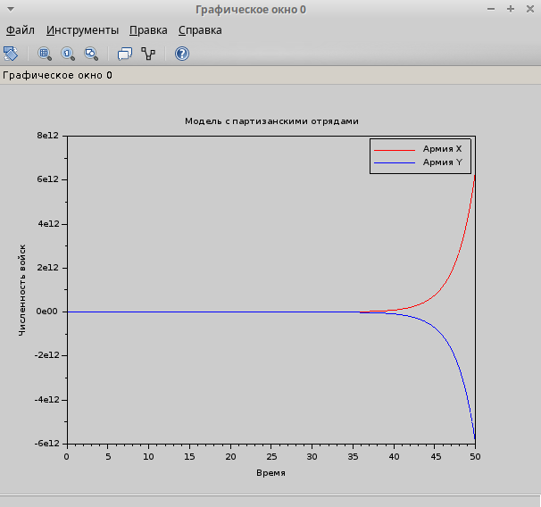

---
## Front matter
title: "Лабораторная работа №3"
subtitle: "Задача 45"
author: "Хватов Максим Григорьевич"

## Generic otions
lang: ru-RU
toc-title: "Содержание"

## Bibliography
bibliography: bib/cite.bib
csl: pandoc/csl/gost-r-7-0-5-2008-numeric.csl

## Pdf output format
toc: true # Table of contents
toc-depth: 2
lof: true # List of figures
lot: false # List of tables
fontsize: 12pt
linestretch: 1.5
papersize: a4
documentclass: scrreprt
## I18n polyglossia
polyglossia-lang:
  name: russian
  options:
	- spelling=modern
	- babelshorthands=true
polyglossia-otherlangs:
  name: english
## I18n babel
babel-lang: russian
babel-otherlangs: english
## Fonts
mainfont: PT Serif
romanfont: PT Serif
sansfont: PT Sans
monofont: PT Mono
mainfontoptions: Ligatures=TeX
romanfontoptions: Ligatures=TeX
sansfontoptions: Ligatures=TeX,Scale=MatchLowercase
monofontoptions: Scale=MatchLowercase,Scale=0.9
## Biblatex
biblatex: true
biblio-style: "gost-numeric"
biblatexoptions:
  - parentracker=true
  - backend=biber
  - hyperref=auto
  - language=auto
  - autolang=other*
  - citestyle=gost-numeric
## Pandoc-crossref LaTeX customization
figureTitle: "Рис."
tableTitle: "Таблица"
listingTitle: "Листинг"
lofTitle: "Список иллюстраций"
lotTitle: "Список таблиц"
lolTitle: "Листинги"
## Misc options
indent: true
header-includes:
  - \usepackage{indentfirst}
  - \usepackage{float} # keep figures where there are in the text
  - \floatplacement{figure}{H} # keep figures where there are in the text
---

# Цель работы

Приобрести практические навыки работы с scilab по решению математических задач моделирования боевых действий с различными видами войск

# Задание

Между страной Х и страной У идет война. Численность состава войск
исчисляется от начала войны, и являются временными функциями
xt( ) и yt( ). В начальный момент времени страна Х имеет армию численностью 22 222 человек, а
в распоряжении страны У армия численностью в 11 111 человек. Для упрощения
модели считаем, что коэффициенты a b c h постоянны. Также считаем P(t) и Q(t) непрерывные функции.
Постройте графики изменения численности войск армии Х и армии У для
следующих случаев:
1. Модель боевых действий между регулярными войсками
2. Модель ведение боевых действий с участием регулярных войск и партизанских отрядов

# Выполнение лабораторной работы

Сначала я зайду в scilab и создам новый файл, где буду прописывать исходный код программы, которая будет решать задачу из варианта 45.

Исхоный кодимеет следующий вид:

```
funcprot(0); // Отключение предупреждений о переопределении функций

function dy = model1(t, y)
    dy = zeros(2, 1);
    dy(1) = -0.22 * y(1) - 0.77 * y(2) + sin(0.5 * t);
    dy(2) = -0.66 * y(1) - 0.11 * y(2) + cos(0.5 * t);
endfunction

function dy = model2(t, y)
    dy = zeros(2, 1);
    dy(1) = -0.31 * y(1) - 0.79 * y(2) + sin(2.5 * t);
    dy(2) = -0.59 * y(1) - 0.21 * y(2) + cos(2 * t);
endfunction

// Начальные условия
x0 = [22222; 11111];
t0 = 0; // Начальное время
tmax = 50; // Время моделирования
dt = 0.01; // Уменьшенный шаг интегрирования для стабильности
t = t0:dt:tmax;

// Решение первой модели
y = ode(x0, t0, t, model1); // Убрано "rk45", так как Scilab использует другой формат
plot(t, y(1,:), 'r', t, y(2,:), 'b')
xlabel("Время")
ylabel("Численность войск")
title("Модель боевых действий между регулярными войсками")
legend("Армия X", "Армия Y")
grid()

// Решение второй модели
y = ode(x0, t0, t, model2);
figure()
plot(t, y(1,:), 'r', t, y(2,:), 'b')
xlabel("Время")
ylabel("Численность войск")
title("Модель с партизанскими отрядами")
legend("Армия X", "Армия Y")
grid()

```

В результате запуска кода, получаются следующие графики для случая, когда воюют регулярные армии (рис. [-@fig:001]) и регулярная армия с партизанами (рис. [-@fig:002])

{#fig:001 width=70%}

{#fig:002 width=70%}

# Выводы

В процессе выполнения лабораторной работы я получил практические навыки работы с scilab по решению математических задач моделирования боевых действий с различными видами войск
