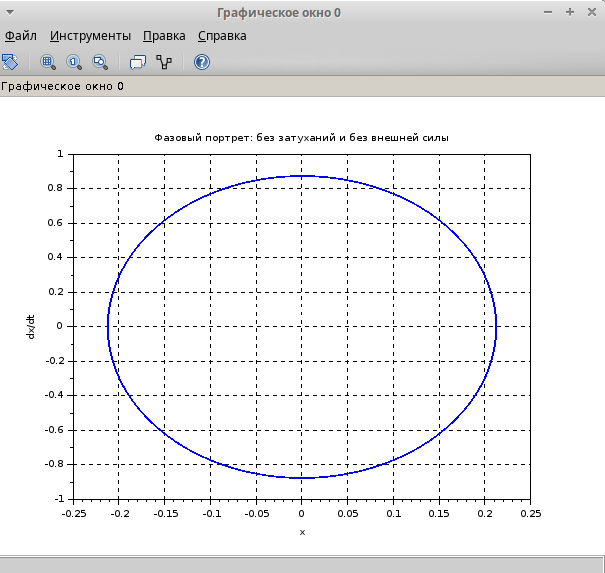
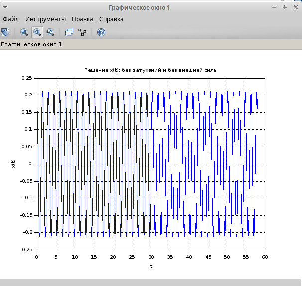
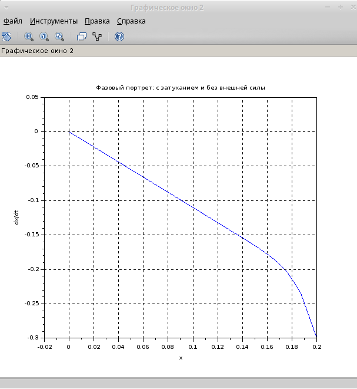
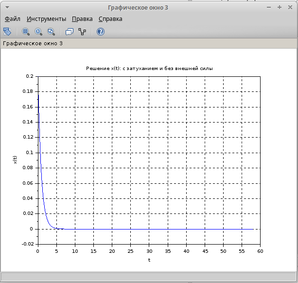
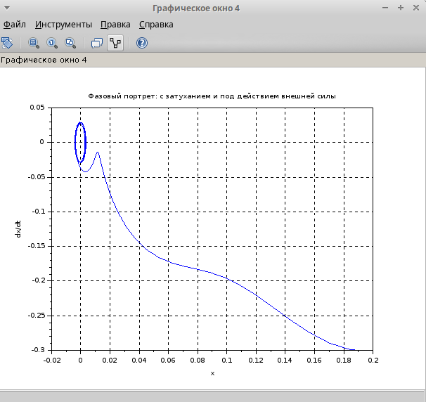
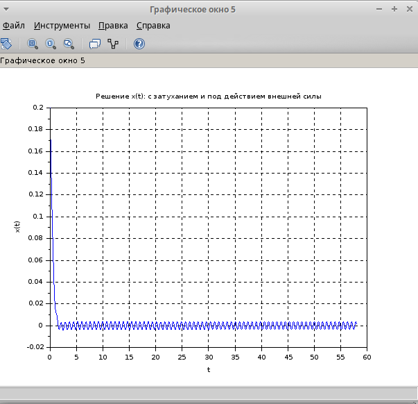

---
## Front matter
lang: ru-RU
title: Лабораторная работа №4
subtitle: Задача 45
author:
  - Хватов М.Г.
institute:
  - Российский университет дружбы народов, Москва, Россия

## i18n babel
babel-lang: russian
babel-otherlangs: english

## Formatting pdf
toc: false
toc-title: Содержание
slide_level: 2
aspectratio: 169
section-titles: true
theme: metropolis
header-includes:
 - \metroset{progressbar=frametitle,sectionpage=progressbar,numbering=fraction}
 - '\makeatletter'
 - '\beamer@ignorenonframefalse'
 - '\makeatother'
---

# Информация

## Докладчик

:::::::::::::: {.columns align=center}
::: {.column width="70%"}

  * Хватов Максим Григорьевич
  * студент
  * Российский университет дружбы народов
  * [1032204364@pfur.ru](mailto:1032204364@pfur.ru)

:::
::: {.column width="25%"}


:::
::::::::::::::


## Цель работы

Приобрести практические навыки работы с scilab по решению задач моделирования гармонического осциллятора

## Задания

Построить фазовый портрет и решение уравнения гармонического осциллятора для следующих случаев:
1. Колебания без затуханий и без внешней силы: $$\ddot{x} + 17x = 0$$.
2. Колебания с затуханием и без внешней силы: $$\ddot{x} + 22\dot{x} + 23x = 0$$.
3. Колебания с затуханием и под действием внешней силы: $$\ddot{x} + 5\dot{x} + 8x = 0.25 \sin(8t)$$.

На интервале $$ t \in [0; 58] $$ с шагом 0.05 и начальными условиями $$ x_0 = 0.2 $$, $$ y_0 = -0.3 $$.

# Выполнение лабораторной работы

```julia
// Вариант №45

// Параметры
t0 = 0;          // Начальное время
t_end = 58;      // Конечное время
dt = 0.05;       // Шаг времени
t = t0:dt:t_end; // Вектор времени

// Начальные условия
x0 = 0.2;        // Начальное положение
y0 = -0.3;       // Начальная скорость

// 1. Колебания без затуханий и без внешней силы
function dx = system1(t, x)
    dx(1) = x(2);           // dx/dt = y
    dx(2) = -17 * x(1);     // dy/dt = -17x
endfunction

// Решение системы
sol1 = ode([x0; y0], t0, t, system1);
```

# Выполнение лабораторной работы

```julia
// 2. Колебания с затуханием и без внешней силы
function dx = system2(t, x)
    dx(1) = x(2);           // dx/dt = y
    dx(2) = -23 * x(1) - 22 * x(2); // dy/dt = -23x - 22y
endfunction

// Решение системы
sol2 = ode([x0; y0], t0, t, system2);
```

# Выполнение лабораторной работы

```julia
// 3. Колебания с затуханием и под действием внешней силы
function dx = system3(t, x)
    dx(1) = x(2);           // dx/dt = y
    dx(2) = -8 * x(1) - 5 * x(2) + 0.25 * sin(8 * t); // dy/dt = -8x - 5y + 0.25*sin(8t)
endfunction
```

# Выполнение лабораторной работы

{#fig:001 width=70%}

# Выполнение лабораторной работы

{#fig:002 width=70%}

# Выполнение лабораторной работы

{#fig:005 width=70%}

# Выполнение лабораторной работы

{#fig:006 width=70%}

# Выполнение лабораторной работы

{#fig:003 width=70%}

# Выполнение лабораторной работы

{#fig:004 width=70%}

# Выводы

1. В первом случа незатухающие  гармонические колебания
2. Во втором случае колебания затухают из-за наличия трения
3. В третьем случае добавление внешней силы приводит к вынуженным колебаниям с затуханием