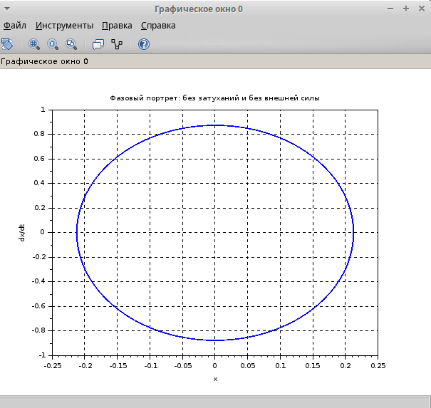
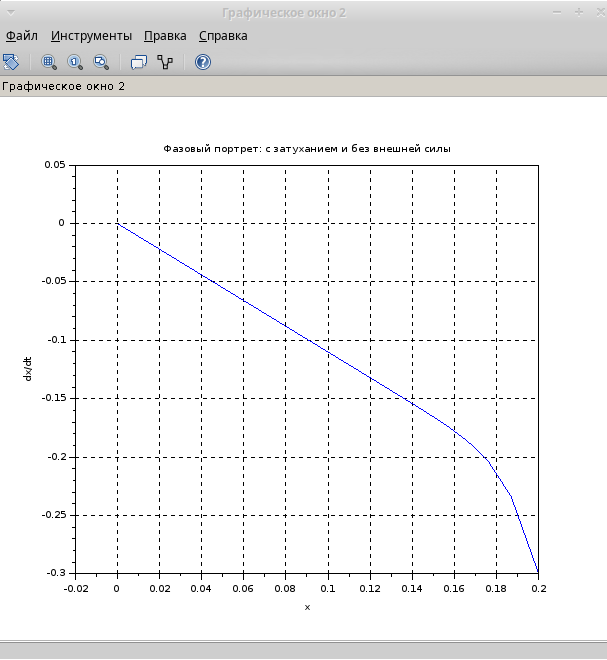
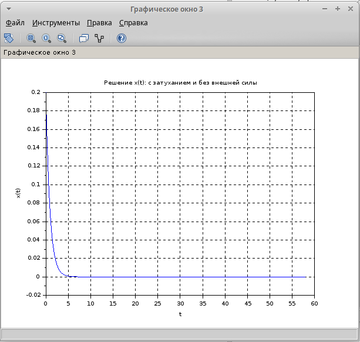
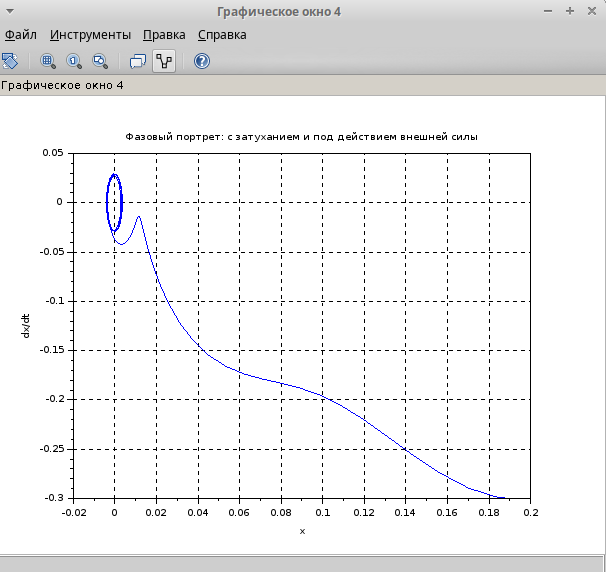
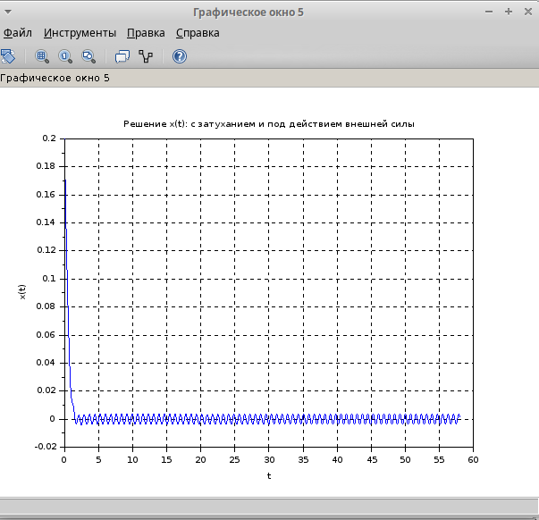

---
## Front matter
title: "Лабораторная работа №4"
subtitle: "Задача 45"
author: "Хватов Максим Григорьевич"

## Generic otions
lang: ru-RU
toc-title: "Содержание"

## Bibliography
bibliography: bib/cite.bib
csl: pandoc/csl/gost-r-7-0-5-2008-numeric.csl

## Pdf output format
toc: true # Table of contents
toc-depth: 2
lof: true # List of figures
lot: false # List of tables
fontsize: 12pt
linestretch: 1.5
papersize: a4
documentclass: scrreprt
## I18n polyglossia
polyglossia-lang:
  name: russian
  options:
	- spelling=modern
	- babelshorthands=true
polyglossia-otherlangs:
  name: english
## I18n babel
babel-lang: russian
babel-otherlangs: english
## Fonts
mainfont: PT Serif
romanfont: PT Serif
sansfont: PT Sans
monofont: PT Mono
mainfontoptions: Ligatures=TeX
romanfontoptions: Ligatures=TeX
sansfontoptions: Ligatures=TeX,Scale=MatchLowercase
monofontoptions: Scale=MatchLowercase,Scale=0.9
## Biblatex
biblatex: true
biblio-style: "gost-numeric"
biblatexoptions:
  - parentracker=true
  - backend=biber
  - hyperref=auto
  - language=auto
  - autolang=other*
  - citestyle=gost-numeric
## Pandoc-crossref LaTeX customization
figureTitle: "Рис."
tableTitle: "Таблица"
listingTitle: "Листинг"
lofTitle: "Список иллюстраций"
lotTitle: "Список таблиц"
lolTitle: "Листинги"
## Misc options
indent: true
header-includes:
  - \usepackage{indentfirst}
  - \usepackage{float} # keep figures where there are in the text
  - \floatplacement{figure}{H} # keep figures where there are in the text
---

# Цель работы

Приобрести практические навыки работы с scilab по решению задач моделирования гармонического осциллятора

# Задание

Построить фазовый портрет и решение уравнения гармонического осциллятора для следующих случаев:
1. Колебания без затуханий и без внешней силы: $$\ddot{x} + 17x = 0$$.
2. Колебания с затуханием и без внешней силы: $$\ddot{x} + 22\dot{x} + 23x = 0$$.
3. Колебания с затуханием и под действием внешней силы: $$\ddot{x} + 5\dot{x} + 8x = 0.25 \sin(8t)$$.
На интервале $$ t \in [0; 58] $$ с шагом 0.05 и начальными условиями $$ x_0 = 0.2 $$, $$ y_0 = -0.3 $$.


# Выполнение лабораторной работы

Сначала я зайду в scilab и создам новый файл, где буду прописывать исходный код программы, которая будет решать задачу из варианта 45.

Исхоный кодимеет следующий вид:

```julia
// Вариант №45

// Параметры
t0 = 0;          // Начальное время
t_end = 58;      // Конечное время
dt = 0.05;       // Шаг времени
t = t0:dt:t_end; // Вектор времени

// Начальные условия
x0 = 0.2;        // Начальное положение
y0 = -0.3;       // Начальная скорость

// 1. Колебания без затуханий и без внешней силы
function dx = system1(t, x)
    dx(1) = x(2);           // dx/dt = y
    dx(2) = -17 * x(1);     // dy/dt = -17x
endfunction

// Решение системы
sol1 = ode([x0; y0], t0, t, system1);

// Построение фазового портрета
scf(0);
plot(sol1(1,:), sol1(2,:));
xlabel('x');
ylabel('dx/dt');
title('Фазовый портрет: без затуханий и без внешней силы');
xgrid();

// Построение решения x(t)
scf(1);
plot(t, sol1(1,:));
xlabel('t');
ylabel('x(t)');
title('Решение x(t): без затуханий и без внешней силы');
xgrid();

// 2. Колебания с затуханием и без внешней силы
function dx = system2(t, x)
    dx(1) = x(2);           // dx/dt = y
    dx(2) = -23 * x(1) - 22 * x(2); // dy/dt = -23x - 22y
endfunction

// Решение системы
sol2 = ode([x0; y0], t0, t, system2);

// Построение фазового портрета
scf(2);
plot(sol2(1,:), sol2(2,:));
xlabel('x');
ylabel('dx/dt');
title('Фазовый портрет: с затуханием и без внешней силы');
xgrid();

// Построение решения x(t)
scf(3);
plot(t, sol2(1,:));
xlabel('t');
ylabel('x(t)');
title('Решение x(t): с затуханием и без внешней силы');
xgrid();

// 3. Колебания с затуханием и под действием внешней силы
function dx = system3(t, x)
    dx(1) = x(2);           // dx/dt = y
    dx(2) = -8 * x(1) - 5 * x(2) + 0.25 * sin(8 * t); // dy/dt = -8x - 5y + 0.25*sin(8t)
endfunction

// Решение системы
sol3 = ode([x0; y0], t0, t, system3);

// Построение фазового портрета
scf(4);
plot(sol3(1,:), sol3(2,:));
xlabel('x');
ylabel('dx/dt');
title('Фазовый портрет: с затуханием и под действием внешней силы');
xgrid();

// Построение решения x(t)
scf(5);
plot(t, sol3(1,:));
xlabel('t');
ylabel('x(t)');
title('Решение x(t): с затуханием и под действием внешней силы');
xgrid();

```

## Результаты

#### 1. Колебания без затуханий и без внешней силы
- **Уравнение**: $$\ddot{x} + 17x = 0$$.
- **Фазовый портрет**:
  {width=70%}
- **Решение $$ x(t) $$**:
  {width=70%}

#### 2. Колебания с затуханием и без внешней силы
- **Уравнение**: $$\ddot{x} + 22\dot{x} + 23x = 0$$.
- **Фазовый портрет**:
  {width=70%}
- **Решение $$ x(t) $$**:
  {width=70%}

#### 3. Колебания с затуханием и под действием внешней силы
- **Уравнение**: $$\ddot{x} + 5\dot{x} + 8x = 0.25 \sin(8t)$$.
- **Фазовый портрет**:
  {width=70%}
- **Решение $$ x(t) $$**:
  {width=70%}


# Выводы

1. В первом случа незатухающие  гармонические колебания
2. Во втором случае колебания затухают из-за наличия трения
3. В третьем случае добавление внешней силы приводит к вынуженным колебаниям с затуханием