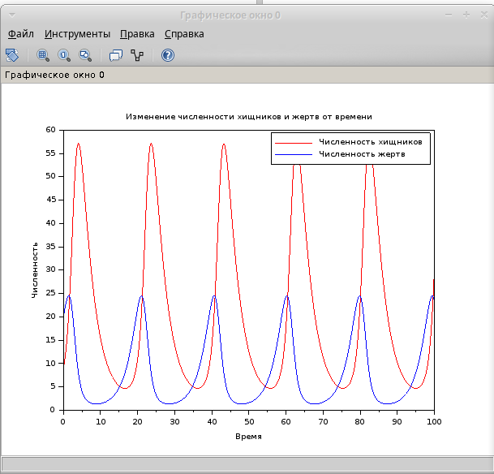
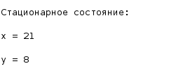
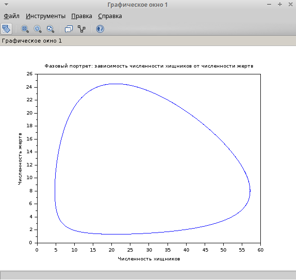

---
## Front matter
lang: ru-RU
title: Лабораторная работа №5
subtitle: Модель хищник-жертва
author:
  - Хватов М.Г.
institute:
  - Российский университет дружбы народов, Москва, Россия

## i18n babel
babel-lang: russian
babel-otherlangs: english

## Formatting pdf
toc: false
toc-title: Содержание
slide_level: 2
aspectratio: 169
section-titles: true
theme: metropolis
header-includes:
 - \metroset{progressbar=frametitle,sectionpage=progressbar,numbering=fraction}
 - '\makeatletter'
 - '\beamer@ignorenonframefalse'
 - '\makeatother'
---

# Информация

## Докладчик

:::::::::::::: {.columns align=center}
::: {.column width="70%"}

  * Хватов Максим Григорьевич
  * студент
  * Российский университет дружбы народов
  * [1032204364@pfur.ru](mailto:1032204364@pfur.ru)

:::
::: {.column width="25%"}


:::
::::::::::::::


## Цель работы

Исследование динамики численности популяций хищников и жертв с использованием модели Лотки-Вольтерры. Построение графиков изменения численности популяций и фазового портрета системы. Нахождение стационарного состояния системы.

## Задания

1. Построить графики изменения численности хищников и жертв от времени.

2. Построить фазовый портрет системы.

3. Найти стационарное состояние системы.

# Выполнение лабораторной работы

```julia
// Определение параметров модели
a = -0.32;  // коэффициент смертности хищников
b = 0.04;   // коэффициент, описывающий влияние жертв на хищников
c = 0.42;   // коэффициент прироста жертв
d = -0.02;  // коэффициент, описывающий влияние хищников на жертв

// Определение системы дифференциальных уравнений
function dxdt = syst(t, x)
    dxdt(1) = a * x(1) + b * x(1) * x(2);  // dx/dt
    dxdt(2) = c * x(2) + d * x(1) * x(2);  // dy/dt
endfunction

// Начальные условия
x0 = [9; 20];  // начальные значения: x(0) = 9, y(0) = 20
t0 = 0;        // начальное время
t = 0:0.1:100; // временной интервал от 0 до 100 с шагом 0.1

// Решение системы дифференциальных уравнений
y = ode(x0, t0, t, syst);
```

# Выполнение лабораторной работы

```julia
// Построение графиков
scf(0);
plot(t, y(1, :), 'r'); // график изменения численности хищников x(t)
plot(t, y(2, :), 'b'); // график изменения численности жертв y(t)
xlabel('Время');
ylabel('Численность');
legend(['Численность хищников'; 'Численность жертв']);
title('Изменение численности хищников и жертв от времени');
```

# Выполнение лабораторной работы

```julia
scf(1);
plot(y(1, :), y(2, :)); // фазовый портрет: зависимость y от x
xlabel('Численность хищников');
ylabel('Численность жертв');
title('Фазовый портрет: зависимость численности хищников от численности жертв');
```

# Выполнение лабораторной работы

```julia
// Нахождение стационарного состояния
// Стационарное состояние достигается при dx/dt = 0 и dy/dt = 0
// Решаем систему уравнений:
// -0.32*x + 0.04*x*y = 0
// 0.42*y - 0.02*x*y = 0

// Решение системы уравнений
x_stat = c / abs(d);  // стационарное значение x
y_stat = abs(a) / b;  // стационарное значение y
```
# Выполнение лабораторной работы

```julia
// Вывод стационарного состояния
disp("Стационарное состояние:");
disp("x = " + string(x_stat));
disp("y = " + string(y_stat));
```

# Выполнение лабораторной работы

{width=70%}

# Выполнение лабораторной работы

{width=70%}

# Выполнение лабораторной работы

{width=70%}

# Выводы

Модель "хищник-жертва" демонстрирует периодические колебания численности популяций хищников и жертв.
Фазовый портрет системы показывает замкнутые траектории, что подтверждает периодический характер колебаний.
Стационарное состояние системы достигается при x=21 и y=8. В этом состоянии численности популяций остаются постоянными.