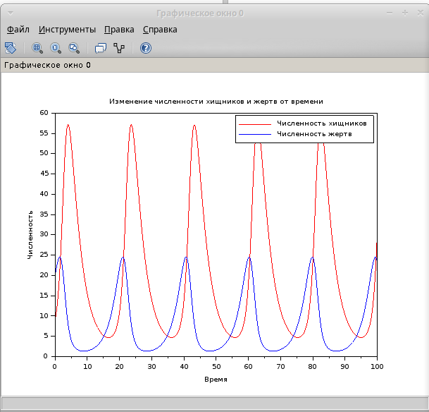
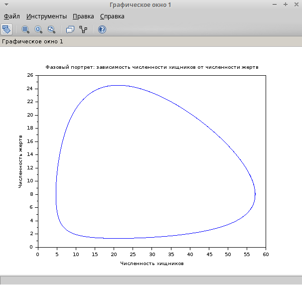
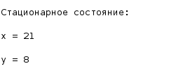

---
## Front matter
title: "Лабораторная работа №5"
subtitle: "Модель хищник-жертва"
author: "Хватов Максим Григорьевич"

## Generic otions
lang: ru-RU
toc-title: "Содержание"

## Bibliography
bibliography: bib/cite.bib
csl: pandoc/csl/gost-r-7-0-5-2008-numeric.csl

## Pdf output format
toc: true # Table of contents
toc-depth: 2
lof: true # List of figures
lot: false # List of tables
fontsize: 12pt
linestretch: 1.5
papersize: a4
documentclass: scrreprt
## I18n polyglossia
polyglossia-lang:
  name: russian
  options:
	- spelling=modern
	- babelshorthands=true
polyglossia-otherlangs:
  name: english
## I18n babel
babel-lang: russian
babel-otherlangs: english
## Fonts
mainfont: PT Serif
romanfont: PT Serif
sansfont: PT Sans
monofont: PT Mono
mainfontoptions: Ligatures=TeX
romanfontoptions: Ligatures=TeX
sansfontoptions: Ligatures=TeX,Scale=MatchLowercase
monofontoptions: Scale=MatchLowercase,Scale=0.9
## Biblatex
biblatex: true
biblio-style: "gost-numeric"
biblatexoptions:
  - parentracker=true
  - backend=biber
  - hyperref=auto
  - language=auto
  - autolang=other*
  - citestyle=gost-numeric
## Pandoc-crossref LaTeX customization
figureTitle: "Рис."
tableTitle: "Таблица"
listingTitle: "Листинг"
lofTitle: "Список иллюстраций"
lotTitle: "Список таблиц"
lolTitle: "Листинги"
## Misc options
indent: true
header-includes:
  - \usepackage{indentfirst}
  - \usepackage{float} # keep figures where there are in the text
  - \floatplacement{figure}{H} # keep figures where there are in the text
---

# Цель работы

Исследование динамики численности популяций хищников и жертв с использованием модели Лотки-Вольтерры. Построение графиков изменения численности популяций и фазового портрета системы. Нахождение стационарного состояния системы.

# Задание

1. Построить графики изменения численности хищников и жертв от времени.

2. Построить фазовый портрет системы.

3. Найти стационарное состояние системы.


### 1. Построение графиков изменения численности популяций

Для решения системы дифференциальных уравнений использовалась среда Scilab. Ниже приведен код для построения графиков:

```julia
// Определение параметров модели
a = -0.32;  // коэффициент смертности хищников
b = 0.04;   // коэффициент, описывающий влияние жертв на хищников
c = 0.42;   // коэффициент прироста жертв
d = -0.02;  // коэффициент, описывающий влияние хищников на жертв

// Определение системы дифференциальных уравнений
function dxdt = syst(t, x)
    dxdt(1) = a * x(1) + b * x(1) * x(2);  // dx/dt
    dxdt(2) = c * x(2) + d * x(1) * x(2);  // dy/dt
endfunction

// Начальные условия
x0 = [9; 20];  // начальные значения: x(0) = 9, y(0) = 20
t0 = 0;        // начальное время
t = 0:0.1:100; // временной интервал от 0 до 100 с шагом 0.1

// Решение системы дифференциальных уравнений
y = ode(x0, t0, t, syst);

// Построение графиков
scf(0);
plot(t, y(1, :), 'r'); // график изменения численности хищников x(t)
plot(t, y(2, :), 'b'); // график изменения численности жертв y(t)
xlabel('Время');
ylabel('Численность');
legend(['Численность хищников'; 'Численность жертв']);
title('Изменение численности хищников и жертв от времени');

scf(1);
plot(y(1, :), y(2, :)); // фазовый портрет: зависимость y от x
xlabel('Численность хищников');
ylabel('Численность жертв');
title('Фазовый портрет: зависимость численности хищников от численности жертв');

// Нахождение стационарного состояния
// Стационарное состояние достигается при dx/dt = 0 и dy/dt = 0
// Решаем систему уравнений:
// -0.32*x + 0.04*x*y = 0
// 0.42*y - 0.02*x*y = 0

// Решение системы уравнений
x_stat = c / abs(d);  // стационарное значение x
y_stat = abs(a) / b;  // стационарное значение y

// Вывод стационарного состояния
disp("Стационарное состояние:");
disp("x = " + string(x_stat));
disp("y = " + string(y_stat));
```

В результате выполнения кода я получил два графика и стационарные точки:

{width=70%}

{width=70%}

{width=70%}


# Выводы

Модель "хищник-жертва" демонстрирует периодические колебания численности популяций хищников и жертв.
Фазовый портрет системы показывает замкнутые траектории, что подтверждает периодический характер колебаний.
Стационарное состояние системы достигается при x=21 и y=8. В этом состоянии численности популяций остаются постоянными.