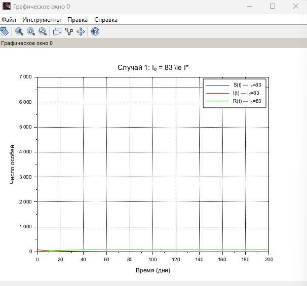
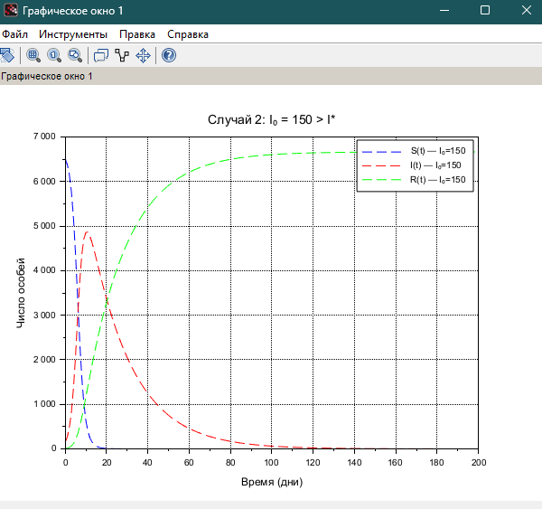

---
## Front matter
lang: ru-RU
title: Лабораторная работа №6Моделирование распространения эпидемии (SIR-модель)Модель хищник-жертва
author:
  - Хватов М.Г.
institute:
  - Российский университет дружбы народов, Москва, Россия

## i18n babel
babel-lang: russian
babel-otherlangs: english

## Formatting pdf
toc: false
toc-title: Содержание
slide_level: 2
aspectratio: 169
section-titles: true
theme: metropolis
header-includes:
 - \metroset{progressbar=frametitle,sectionpage=progressbar,numbering=fraction}
 - '\makeatletter'
 - '\beamer@ignorenonframefalse'
 - '\makeatother'
---

# Информация

## Докладчик

:::::::::::::: {.columns align=center}
::: {.column width="70%"}

  * Хватов Максим Григорьевич
  * студент
  * Российский университет дружбы народов
  * [1032204364@pfur.ru](mailto:1032204364@pfur.ru)

:::
::: {.column width="25%"}


:::
::::::::::::::


## Цель работы

Исследовать распространение эпидемии с помощью численного решения системы дифференциальных уравнений и построить графики изменения численности восприимчивых, инфицированных и выздоровевших в двух различных случаях: при начальном числе заражённых, меньшем либо равном критическому значению \( I^* \), и при превышении этого значения.

## Задания

На одном острове вспыхнула эпидемия. Известно, что из всех проживающих
на острове (N=6 666) в момент начала эпидемии (t=0) число заболевших людей
(являющихся распространителями инфекции) I(0)=83, А число здоровых людей с
иммунитетом к болезни R(0)=6. Таким образом, число людей восприимчивых к
болезни, но пока здоровых, в начальный момент времени S(0)=N-I(0)- R(0).
Постройте графики изменения числа особей в каждой из трех групп

# Выполнение лабораторной работы

```julia
function dydt = system_epidemic(t, y, alpha, beta, I_star)
    S = y(1);
    I = y(2);
    R = y(3);
    
    if I > I_star then
        dS = -alpha * S * I;
        dI = alpha * S * I - beta * I;
    else
        dS = 0;
        dI = -beta * I;
    end

    dR = beta * I;
    dydt = [dS; dI; dR];
endfunction
```

# Выполнение лабораторной работы

```julia
// Общие параметры
alpha = 0.0001;
beta = 0.05;
I_star = 100;
N = 6666;
t = 0:1:200;
```

# Выполнение лабораторной работы

```julia
// ---- Случай 1: I0 <= I*
I0_1 = 83;
R0_1 = 6;
S0_1 = N - I0_1 - R0_1;
y0_1 = [S0_1; I0_1; R0_1];

deff('dydt = f1(t,y)', 'dydt = system_epidemic(t, y, alpha, beta, I_star)');
y1 = ode(y0_1, 0, t, f1);
```

# Выполнение лабораторной работы

```julia
// ---- Случай 2: I0 > I*
I0_2 = 150;
R0_2 = 6;
S0_2 = N - I0_2 - R0_2;
y0_2 = [S0_2; I0_2; R0_2];

deff('dydt = f2(t,y)', 'dydt = system_epidemic(t, y, alpha, beta, I_star)');
y2 = ode(y0_2, 0, t, f2);
```
# Выполнение лабораторной работы

```julia
scf(0);
plot(t, y1(1,:), 'b', t, y1(2,:), 'r', t, y1(3,:), 'g');
legend("S(t) — I₀=83", "I(t) — I₀=83", "R(t) — I₀=83");
xtitle("Случай 1: I₀ = 83 \le I*", "Время (дни)", "Число особей");
xgrid();

scf(1);
plot(t, y2(1,:), 'b--', t, y2(2,:), 'r--', t, y2(3,:), 'g--');
legend("S(t) — I₀=150", "I(t) — I₀=150", "R(t) — I₀=150");
xtitle("Случай 2: I₀ = 150 > I*", "Время (дни)", "Число особей");
xgrid();
```

# Выполнение лабораторной работы

{width=70%}

# Выполнение лабораторной работы

{width=70%}

# Выводы

- При \( I(0) \le I^* \) заражение не распространяется, так как не достигается критическое значение инфицированных.
- При \( I(0) > I^* \) наблюдается массовое заражение, за которым следует спад. Это соответствует классическому сценарию эпидемии.
- Модель SIR позволяет прогнозировать течение эпидемии и оценить эффективность ограничительных мер в зависимости от начальных условий.