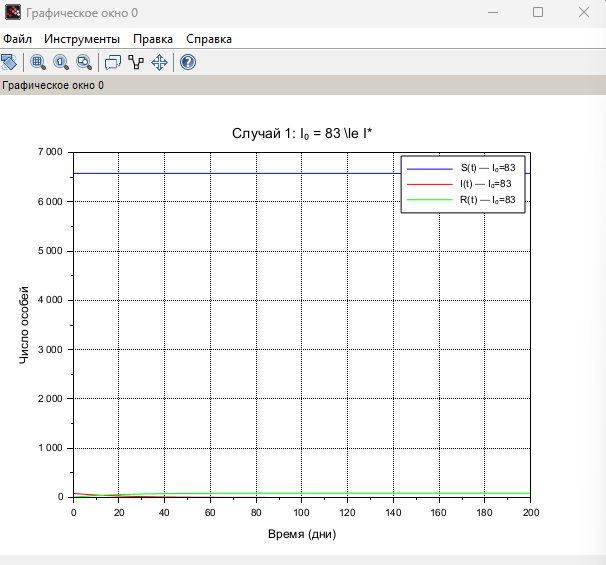
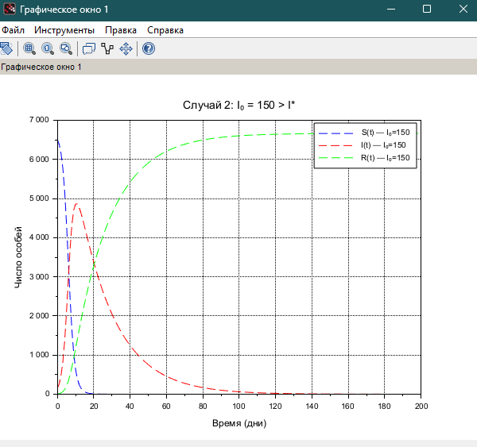

---
## Front matter
title: "Лабораторная работа №6"
subtitle: "Моделирование распространения эпидемии (SIR-модель)"
author: "Хватов Максим Григорьевич"

## Generic otions
lang: ru-RU
toc-title: "Содержание"

## Bibliography
bibliography: bib/cite.bib
csl: pandoc/csl/gost-r-7-0-5-2008-numeric.csl

## Pdf output format
toc: true # Table of contents
toc-depth: 2
lof: true # List of figures
lot: false # List of tables
fontsize: 12pt
linestretch: 1.5
papersize: a4
documentclass: scrreprt
## I18n polyglossia
polyglossia-lang:
  name: russian
  options:
	- spelling=modern
	- babelshorthands=true
polyglossia-otherlangs:
  name: english
## I18n babel
babel-lang: russian
babel-otherlangs: english
## Fonts
mainfont: PT Serif
romanfont: PT Serif
sansfont: PT Sans
monofont: PT Mono
mainfontoptions: Ligatures=TeX
romanfontoptions: Ligatures=TeX
sansfontoptions: Ligatures=TeX,Scale=MatchLowercase
monofontoptions: Scale=MatchLowercase,Scale=0.9
## Biblatex
biblatex: true
biblio-style: "gost-numeric"
biblatexoptions:
  - parentracker=true
  - backend=biber
  - hyperref=auto
  - language=auto
  - autolang=other*
  - citestyle=gost-numeric
## Pandoc-crossref LaTeX customization
figureTitle: "Рис."
tableTitle: "Таблица"
listingTitle: "Листинг"
lofTitle: "Список иллюстраций"
lotTitle: "Список таблиц"
lolTitle: "Листинги"
## Misc options
indent: true
header-includes:
  - \usepackage{indentfirst}
  - \usepackage{float} # keep figures where there are in the text
  - \floatplacement{figure}{H} # keep figures where there are in the text
---

**Цель работы:**  
Исследовать распространение эпидемии с помощью численного решения системы дифференциальных уравнений и построить графики изменения численности восприимчивых, инфицированных и выздоровевших в двух различных случаях: при начальном числе заражённых, меньшем либо равном критическому значению \( I^* \), и при превышении этого значения.

---

## Исходные данные (Вариант 45)

На острове проживает \( N = 6666 \) человек. Начальные условия:

- **Случай 1:**  
  - \( I(0) = 83 \) — инфицированные  
  - \( R(0) = 6 \) — иммунные  
  - \( S(0) = N - I(0) - R(0) = 6577 \)

- **Случай 2:**  
  - \( I(0) = 150 \) — инфицированные  
  - \( R(0) = 6 \) — иммунные  
  - \( S(0) = N - I(0) - R(0) = 6510 \)

**Параметры модели:**

- \( \alpha = 0.0001 \) — коэффициент заражения  
- \( \beta = 0.05 \) — коэффициент выздоровления  
- \( I^* = 100 \) — пороговое значение числа инфицированных

---

## Математическая модель (SIR)

SIR-модель описывается системой обыкновенных дифференциальных уравнений. В зависимости от того, превышает ли число инфицированных пороговое значение \( I^* \), модель принимает два вида:

**Если \( I > I^* \):**
$$
\begin{aligned}
\frac{dS}{dt} &= -\alpha \cdot S \cdot I \\
\frac{dI}{dt} &= \alpha \cdot S \cdot I - \beta \cdot I \\
\frac{dR}{dt} &= \beta \cdot I
\end{aligned}
$$

**Если \( I \le I^* \):**
$$
\begin{aligned}
\frac{dS}{dt} &= 0 \\
\frac{dI}{dt} &= -\beta \cdot I \\
\frac{dR}{dt} &= \beta \cdot I
\end{aligned}
$$

---

## Реализация в Scilab

Реализация модели выполнена в **Scilab** с использованием численного метода решения системы ОДУ (`ode`). Были построены графики численности \( S(t) \), \( I(t) \), \( R(t) \) во времени для обоих случаев:

1. **Случай 1: \( I(0) = 83 \le I^* \)**  
   Заражение не распространяется. Количество инфицированных экспоненциально убывает, число здоровых остаётся постоянным.

2. **Случай 2: \( I(0) = 150 > I^* \)**  
   Эпидемия активно распространяется. Наблюдается рост числа заболевших с последующим пиком и спадом. Часть восприимчивых переходит в категорию выздоровевших.

---

## Результаты

### Графики для случая 1: \( I(0) \le I^* \)

{ width=70% }

### Графики для случая 2: \( I(0) > I^* \)

{ width=70% }

---

## Выводы

- При \( I(0) \le I^* \) заражение не распространяется, так как не достигается критическое значение инфицированных.
- При \( I(0) > I^* \) наблюдается массовое заражение, за которым следует спад. Это соответствует классическому сценарию эпидемии.
- Модель SIR позволяет прогнозировать течение эпидемии и оценить эффективность ограничительных мер в зависимости от начальных условий.

## Приложение. Исходный код

```julia
function dydt = system_epidemic(t, y, alpha, beta, I_star)
    S = y(1);
    I = y(2);
    R = y(3);
    
    if I > I_star then
        dS = -alpha * S * I;
        dI = alpha * S * I - beta * I;
    else
        dS = 0;
        dI = -beta * I;
    end

    dR = beta * I;
    dydt = [dS; dI; dR];
endfunction

// Общие параметры
alpha = 0.0001;
beta = 0.05;
I_star = 100;
N = 6666;
t = 0:1:200;

// ---- Случай 1: I0 <= I*
I0_1 = 83;
R0_1 = 6;
S0_1 = N - I0_1 - R0_1;
y0_1 = [S0_1; I0_1; R0_1];

deff('dydt = f1(t,y)', 'dydt = system_epidemic(t, y, alpha, beta, I_star)');
y1 = ode(y0_1, 0, t, f1);

// ---- Случай 2: I0 > I*
I0_2 = 150;
R0_2 = 6;
S0_2 = N - I0_2 - R0_2;
y0_2 = [S0_2; I0_2; R0_2];

deff('dydt = f2(t,y)', 'dydt = system_epidemic(t, y, alpha, beta, I_star)');
y2 = ode(y0_2, 0, t, f2);

// ---- Построение графиков
scf(0);
plot(t, y1(1,:), 'b', t, y1(2,:), 'r', t, y1(3,:), 'g');
legend("S(t) — I₀=83", "I(t) — I₀=83", "R(t) — I₀=83");
xtitle("Случай 1: I₀ = 83 \le I*", "Время (дни)", "Число особей");
xgrid();

scf(1);
plot(t, y2(1,:), 'b--', t, y2(2,:), 'r--', t, y2(3,:), 'g--');
legend("S(t) — I₀=150", "I(t) — I₀=150", "R(t) — I₀=150");
xtitle("Случай 2: I₀ = 150 > I*", "Время (дни)", "Число особей");
xgrid();

```