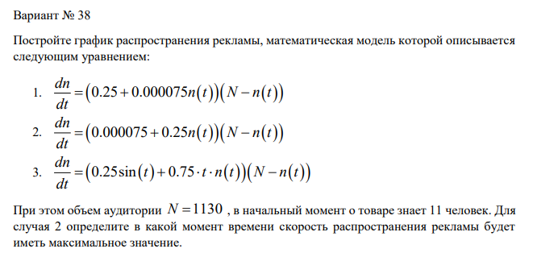
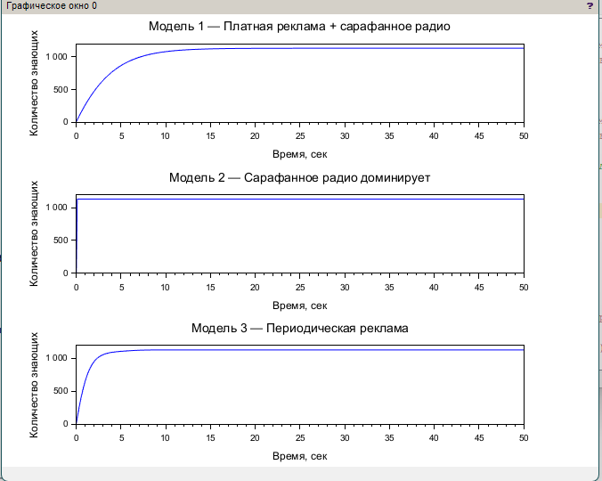
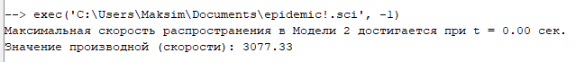

---
## Front matter
lang: ru-RU
title: Задание 38. Распространение рекламы
author:
  - Хватов М.Г.
institute:
  - Российский университет дружбы народов, Москва, Россия

## i18n babel
babel-lang: russian
babel-otherlangs: english

## Formatting pdf
toc: false
toc-title: Содержание
slide_level: 2
aspectratio: 169
section-titles: true
theme: metropolis
header-includes:
 - \metroset{progressbar=frametitle,sectionpage=progressbar,numbering=fraction}
 - '\makeatletter'
 - '\beamer@ignorenonframefalse'
 - '\makeatother'
---

# Информация

## Докладчик

:::::::::::::: {.columns align=center}
::: {.column width="70%"}

  * Хватов Максим Григорьевич
  * студент
  * Российский университет дружбы народов
  * [1032204364@pfur.ru](mailto:1032204364@pfur.ru)

:::
::: {.column width="25%"}


:::
::::::::::::::


## Цель работы

Целью лабораторной работы является исследование математической модели распространения рекламы, учитывающей влияние как платной рекламы, так и эффекта сарафанного радио. В рамках работы необходимо реализовать численное решение модели в среде Scilab, сравнить динамику в различных вариантах параметров, построить графики и определить момент наибольшей скорости распространения рекламы.

## Задания

{width=70%}

# Выполнение лабораторной работы

```julia
// --- Шаг 1: Исходные данные ---
t0 = 0;
T = 50;
dt = 0.1;
t = t0:dt:T;
N = 1130;
x0 = 11;
```

# Выполнение лабораторной работы

```julia
// --- Шаг 2: Модель 1 ---
function dx = model1(t, x)
    dx = (0.25 + 0.000075 * x) * (N - x);
endfunction
x1 = ode(x0, t0, t, model1);
```

# Выполнение лабораторной работы

```julia
// --- Шаг 3: Модель 2 ---
function dx = model2(t, x)
    dx = (0.000075 + 0.25 * x) * (N - x);
endfunction
x2 = ode(x0, t0, t, model2);
```

# Выполнение лабораторной работы

```julia
// --- Шаг 4: Модель 3 ---
function dx = model3(t, x)
    dx = (0.25 * sin(t) + 0.75) * (N - x);
endfunction
x3 = ode(x0, t0, t, model3);
deff('dydt = f2(t,y)', 'dydt = system_epidemic(t, y, alpha, beta, I_star)');
y2 = ode(y0_2, 0, t, f2);
```
# Выполнение лабораторной работы

```julia
// --- Шаг 6: Максимальная скорость в модели 2 ---
dx2 = [];
for i = 1:length(x2)
    dx2(i) = model2(t(i), x2(i));
end

[max_val, max_idx] = max(dx2);
t_max = t(max_idx);
```

# Выполнение лабораторной работы

{width=70%}

# Выполнение лабораторной работы

{width=70%}

# Выводы

- Модель 1 показывает плавный рост за счёт стабильной рекламы и слабого сарафанного радио.

- Модель 2 демонстрирует экспоненциальный рост на начальном этапе, так как чем больше людей знают, тем быстрее информация распространяется.

- Модель 3 добавляет колебания в темпах роста — эффект периодической активности.

- Максимальная скорость в модели 2 достигается при 0, что соответствует наибольшей эффективности сарафанного распространения.
