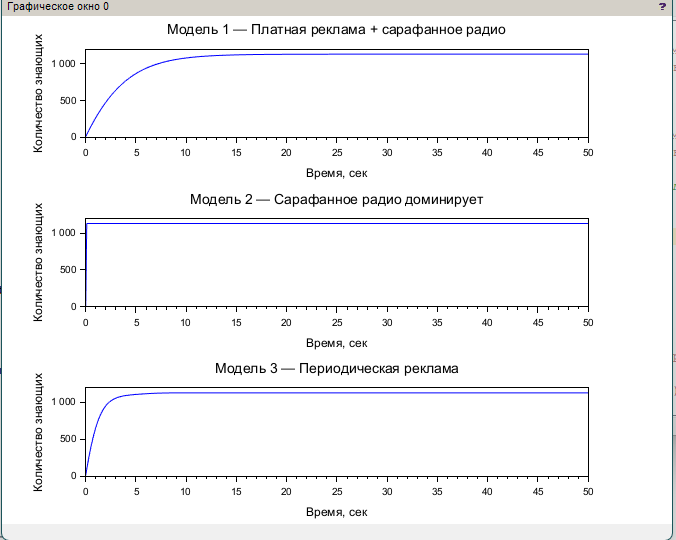
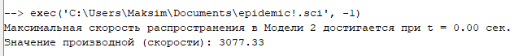

---
## Front matter
title: "Лабораторная работа №7"
subtitle: "Задание 38: Распространение рекламы"
author: "Хватов Максим Григорьевич"

## Generic otions
lang: ru-RU
toc-title: "Содержание"

## Bibliography
bibliography: bib/cite.bib
csl: pandoc/csl/gost-r-7-0-5-2008-numeric.csl

## Pdf output format
toc: true # Table of contents
toc-depth: 2
lof: true # List of figures
lot: false # List of tables
fontsize: 12pt
linestretch: 1.5
papersize: a4
documentclass: scrreprt
## I18n polyglossia
polyglossia-lang:
  name: russian
  options:
	- spelling=modern
	- babelshorthands=true
polyglossia-otherlangs:
  name: english
## I18n babel
babel-lang: russian
babel-otherlangs: english
## Fonts
mainfont: PT Serif
romanfont: PT Serif
sansfont: PT Sans
monofont: PT Mono
mainfontoptions: Ligatures=TeX
romanfontoptions: Ligatures=TeX
sansfontoptions: Ligatures=TeX,Scale=MatchLowercase
monofontoptions: Scale=MatchLowercase,Scale=0.9
## Biblatex
biblatex: true
biblio-style: "gost-numeric"
biblatexoptions:
  - parentracker=true
  - backend=biber
  - hyperref=auto
  - language=auto
  - autolang=other*
  - citestyle=gost-numeric
## Pandoc-crossref LaTeX customization
figureTitle: "Рис."
tableTitle: "Таблица"
listingTitle: "Листинг"
lofTitle: "Список иллюстраций"
lotTitle: "Список таблиц"
lolTitle: "Листинги"
## Misc options
indent: true
header-includes:
  - \usepackage{indentfirst}
  - \usepackage{float} # keep figures where there are in the text
  - \floatplacement{figure}{H} # keep figures where there are in the text
---

### Постановка задачи

Рассматривается модель распространения рекламы, описываемая логистическим уравнением с переменными коэффициентами:

$$
\frac{dn}{dt} = (\alpha(t) + \beta(t)n(t)) (N - n(t))
$$

Где:  
- $n(t)$ — количество людей, знающих о продукте в момент времени $t$;  
- $N = 1130$ — потенциальная аудитория;  
- $n(0) = 11$ — начальное количество знающих;  
- $\alpha(t), \beta(t)$ — функции, определяющие влияние платной рекламы и сарафанного радио соответственно.

Требуется исследовать поведение системы в трёх различных случаях, построить графики зависимости $n(t)$, и для **второго случая** определить момент времени, когда скорость распространения информации максимальна.

---

## Математические модели

### Модель 1
$$
\frac{dn}{dt} = (0.25 + 0.000075 \cdot n)(1130 - n)
$$
**Интерпретация:** постоянное влияние платной рекламы и слабое влияние сарафанного радио.

### Модель 2
$$
\frac{dn}{dt} = (0.000075 + 0.25 \cdot n)(1130 - n)
$$
**Интерпретация:** незначительное постоянное влияние и сильное влияние сарафанного радио.

### Модель 3
$$
\frac{dn}{dt} = (0.25 \cdot \sin(t) + 0.75)(1130 - n)
$$
**Интерпретация:** периодическая реклама (например, телевизионные показы в прайм-тайм).

---

## Реализация в Scilab

```julia
// === Задание 38: Распространение рекламы ===
// Вариант с 3 моделями. N = 1130, n(0) = 11

// --- Шаг 1: Исходные данные ---
t0 = 0;
T = 50;
dt = 0.1;
t = t0:dt:T;
N = 1130;
x0 = 11;

// --- Шаг 2: Модель 1 ---
function dx = model1(t, x)
    dx = (0.25 + 0.000075 * x) * (N - x);
endfunction
x1 = ode(x0, t0, t, model1);

// --- Шаг 3: Модель 2 ---
function dx = model2(t, x)
    dx = (0.000075 + 0.25 * x) * (N - x);
endfunction
x2 = ode(x0, t0, t, model2);

// --- Шаг 4: Модель 3 ---
function dx = model3(t, x)
    dx = (0.25 * sin(t) + 0.75) * (N - x);
endfunction
x3 = ode(x0, t0, t, model3);

// --- Шаг 5: Построение графиков ---
clf();
subplot(3, 1, 1);
plot(t, x1);
title("Модель 1 — Платная реклама + сарафанное радио");
xlabel("Время, сек"); ylabel("Количество знающих");

subplot(3, 1, 2);
plot(t, x2);
title("Модель 2 — Сарафанное радио доминирует");
xlabel("Время, сек"); ylabel("Количество знающих");

subplot(3, 1, 3);
plot(t, x3);
title("Модель 3 — Периодическая реклама");
xlabel("Время, сек"); ylabel("Количество знающих");

// --- Шаг 6: Максимальная скорость в модели 2 ---
dx2 = [];
for i = 1:length(x2)
    dx2(i) = model2(t(i), x2(i));
end

[max_val, max_idx] = max(dx2);
t_max = t(max_idx);

// --- Шаг 7: Вывод результата ---
printf("Максимальная скорость распространения в Модели 2 достигается при t = %.2f сек.\n", t_max);
printf("Значение производной (скорости): %.2f\n", max_val);
```

Резльтат выполнения кода:

{ width=70% }


{ width=70% }

# Выводы

- Модель 1 показывает плавный рост за счёт стабильной рекламы и слабого сарафанного радио.

- Модель 2 демонстрирует экспоненциальный рост на начальном этапе, так как чем больше людей знают, тем быстрее информация распространяется.

- Модель 3 добавляет колебания в темпах роста — эффект периодической активности.

- Максимальная скорость в модели 2 достигается при 0, что соответствует наибольшей эффективности сарафанного распространения.

