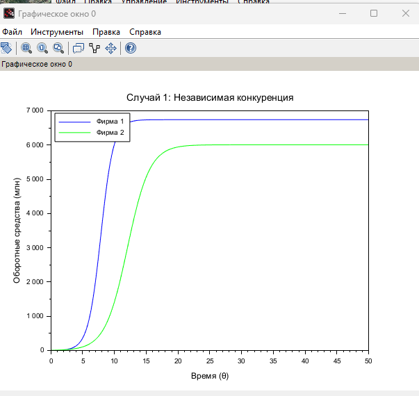
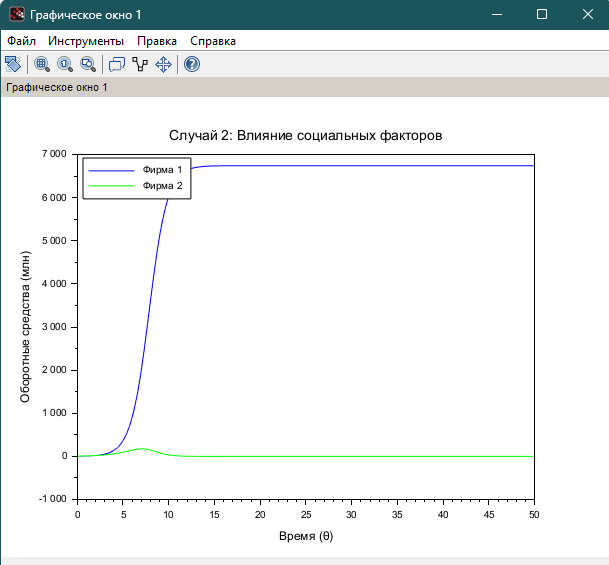

---
## Front matter
lang: ru-RU
title: Лабораторная работа №8
subtitle: Модель конкуренции двух фирм (Вариант 45)
author:
  - Хватов М.Г.
institute:
  - Российский университет дружбы народов, Москва, Россия

## i18n babel
babel-lang: russian
babel-otherlangs: english

## Formatting pdf
toc: false
toc-title: Содержание
slide_level: 2
aspectratio: 169
section-titles: true
theme: metropolis
header-includes:
 - \metroset{progressbar=frametitle,sectionpage=progressbar,numbering=fraction}
 - '\makeatletter'
 - '\beamer@ignorenonframefalse'
 - '\makeatother'
---

# Информация

## Докладчик

:::::::::::::: {.columns align=center}
::: {.column width="70%"}

  * Хватов Максим Григорьевич
  * студент
  * Российский университет дружбы народов
  * [1032204364@pfur.ru](mailto:1032204364@pfur.ru)

:::
::: {.column width="25%"}


:::
::::::::::::::


## Цель работы

Исследовать динамику конкуренции двух фирм на рынке с учетом:  
1. Экономических факторов (себестоимость, длительность производственного цикла)  
2. Социально-психологических факторов (предпочтения потребителей)  
3. Определить условия достижения стационарных состояний  
4. Проанализировать влияние параметров модели на исход конкурентной борьбы  

# Исходные данные  
**Параметры:**  
- Критическая цена: $p_{cr} = 40\,000$  
- Число потребителей: $N = 43\,000$  
- Макс. потребность: $q = 1$  
- Производственные циклы: $\tau_1 = 20$, $\tau_2 = 14$  
- Себестоимости: $\hat{p}_1 = 10\,700$, $\hat{p}_2 = 19\,100$  
- Начальные оборотные средства: $M_1(0) = 2.6\, \text{млн}$, $M_2(0) = 6.2\, \text{млн}$  


# Выполнение лабораторной работы

```julia
// Параметры
p_cr = 40; N = 43; q = 1;
tau1 = 20; p1 = 10.7; tau2 = 14; p2 = 19.1;

// Расчет коэффициентов
a1 = p_cr / (tau1^2 * p1^2 * N * q);
a2 = p_cr / (tau2^2 * p2^2 * N * q);
b = p_cr / (tau1^2 * tau2^2 * p1^2 * p2^2 * N * q);
c1 = (p_cr - p1) / (tau1 * p1);
c2 = (p_cr - p2) / (tau2 * p2);
```

# Выполнение лабораторной работы

```julia
// Система уравнений для Случая 1
function dx = syst1(t, x)
    dx(1) = x(1) - (b/c1)*x(1)*x(2) - (a1/c1)*x(1)^2;
    dx(2) = (c2/c1)*x(2) - (b/c1)*x(1)*x(2) - (a2/c1)*x(2)^2;
endfunction
```

# Выполнение лабораторной работы

```julia
function dx = syst2(t, x)
    dx(1) = x(1) - (b/c1)*x(1)*x(2) - (a1/c1)*x(1)^2;
    dx(2) = (c2/c1)*x(2) - (b/c1 + 0.00026)*x(1)*x(2) - (a2/c1)*x(2)^2;
endfunction
```

# Выполнение лабораторной работы

```julia
t0 = 0; x0 = [2.6; 6.2]; t = 0:0.1:50;
y1 = ode(x0, t0, t, syst1); // Случай 1
y2 = ode(x0, t0, t, syst2); // Случай 2
```
# Выполнение лабораторной работы

```julia
scf(0); clf();
plot(t, y1(1,:), 'b', t, y1(2,:), 'g'); 
title("Случай 1: Независимая конкуренция");
xlabel("Время (θ)"); ylabel("Оборотные средства (млн)");
legend(["Фирма 1"; "Фирма 2"], 2);
```

```julia
scf(1); clf();
plot(t, y2(1,:), 'b', t, y2(2,:), 'g'); 
title("Случай 2: Влияние социальных факторов");
xlabel("Время (θ)"); ylabel("Оборотные средства (млн)");
legend(["Фирма 1"; "Фирма 2"], 2);
```

# Выполнение лабораторной работы

{width=70%}

# Выполнение лабораторной работы

{width=70%}

# Выводы

Модель демонстрирует, что даже при начальном преимуществе Фирмы 2, более низкая себестоимость Фирмы 1 обеспечивает ей рыночное лидерство, а дополнительное влияние социальных факторов приводит к резкому сокращению доли Фирмы 2, подчеркивая важность управления как экономическими, так и социально-психологическими параметрами в конкурентной борьбе.