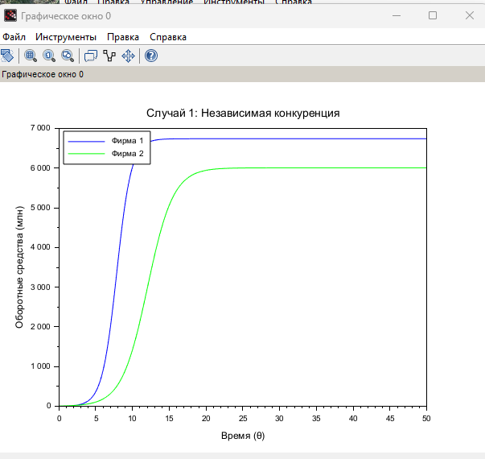
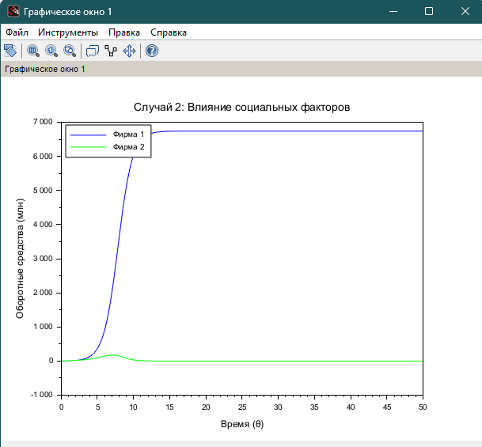

---
## Front matter
title: "Лабораторная работа №8"
subtitle: "Модель конкуренции двух фирм (Вариант 45)"
author: "Хватов Максим Григорьевич"

## Generic otions
lang: ru-RU
toc-title: "Содержание"

## Bibliography
bibliography: bib/cite.bib
csl: pandoc/csl/gost-r-7-0-5-2008-numeric.csl

## Pdf output format
toc: true # Table of contents
toc-depth: 2
lof: true # List of figures
lot: false # List of tables
fontsize: 12pt
linestretch: 1.5
papersize: a4
documentclass: scrreprt
## I18n polyglossia
polyglossia-lang:
  name: russian
  options:
	- spelling=modern
	- babelshorthands=true
polyglossia-otherlangs:
  name: english
## I18n babel
babel-lang: russian
babel-otherlangs: english
## Fonts
mainfont: PT Serif
romanfont: PT Serif
sansfont: PT Sans
monofont: PT Mono
mainfontoptions: Ligatures=TeX
romanfontoptions: Ligatures=TeX
sansfontoptions: Ligatures=TeX,Scale=MatchLowercase
monofontoptions: Scale=MatchLowercase,Scale=0.9
## Biblatex
biblatex: true
biblio-style: "gost-numeric"
biblatexoptions:
  - parentracker=true
  - backend=biber
  - hyperref=auto
  - language=auto
  - autolang=other*
  - citestyle=gost-numeric
## Pandoc-crossref LaTeX customization
figureTitle: "Рис."
tableTitle: "Таблица"
listingTitle: "Листинг"
lofTitle: "Список иллюстраций"
lotTitle: "Список таблиц"
lolTitle: "Листинги"
## Misc options
indent: true
header-includes:
  - \usepackage{indentfirst}
  - \usepackage{float} # keep figures where there are in the text
  - \floatplacement{figure}{H} # keep figures where there are in the text
---

# Цель работы  

Исследовать динамику конкуренции двух фирм на рынке с учетом:  
1. Экономических факторов (себестоимость, длительность производственного цикла)  
2. Социально-психологических факторов (предпочтения потребителей)  
3. Определить условия достижения стационарных состояний  
4. Проанализировать влияние параметров модели на исход конкурентной борьбы  

### Исходные данные  
**Параметры:**  
- Критическая цена: $p_{cr} = 40\,000$  
- Число потребителей: $N = 43\,000$  
- Макс. потребность: $q = 1$  
- Производственные циклы: $\tau_1 = 20$, $\tau_2 = 14$  
- Себестоимости: $\hat{p}_1 = 10\,700$, $\hat{p}_2 = 19\,100$  
- Начальные оборотные средства: $M_1(0) = 2.6\, \text{млн}$, $M_2(0) = 6.2\, \text{млн}$  

**Коэффициенты:**  
$$
a_1 = \frac{p_{cr}}{\tau_1^2 \hat{p}_1^2 N q}, \quad 
a_2 = \frac{p_{cr}}{\tau_2^2 \hat{p}_2^2 N q}, \quad 
b = \frac{p_{cr}}{\tau_1^2 \tau_2^2 \hat{p}_1^2 \hat{p}_2^2 N q}, \\
c_1 = \frac{p_{cr} - \hat{p}_1}{\tau_1 \hat{p}_1}, \quad 
c_2 = \frac{p_{cr} - \hat{p}_2}{\tau_2 \hat{p}_2}.
$$

### Код в Scilab  

```julia
// Параметры
p_cr = 40; N = 43; q = 1;
tau1 = 20; p1 = 10.7; tau2 = 14; p2 = 19.1;

// Расчет коэффициентов
a1 = p_cr / (tau1^2 * p1^2 * N * q);
a2 = p_cr / (tau2^2 * p2^2 * N * q);
b = p_cr / (tau1^2 * tau2^2 * p1^2 * p2^2 * N * q);
c1 = (p_cr - p1) / (tau1 * p1);
c2 = (p_cr - p2) / (tau2 * p2);

// Система уравнений для Случая 1
function dx = syst1(t, x)
    dx(1) = x(1) - (b/c1)*x(1)*x(2) - (a1/c1)*x(1)^2;
    dx(2) = (c2/c1)*x(2) - (b/c1)*x(1)*x(2) - (a2/c1)*x(2)^2;
endfunction

// Система уравнений для Случая 2
function dx = syst2(t, x)
    dx(1) = x(1) - (b/c1)*x(1)*x(2) - (a1/c1)*x(1)^2;
    dx(2) = (c2/c1)*x(2) - (b/c1 + 0.00026)*x(1)*x(2) - (a2/c1)*x(2)^2;
endfunction

// Решение
t0 = 0; x0 = [2.6; 6.2]; t = 0:0.1:50;
y1 = ode(x0, t0, t, syst1); // Случай 1
y2 = ode(x0, t0, t, syst2); // Случай 2

// Построение графиков
scf(0); clf();
plot(t, y1(1,:), 'b', t, y1(2,:), 'g'); 
title("Случай 1: Независимая конкуренция");
xlabel("Время (θ)"); ylabel("Оборотные средства (млн)");
legend(["Фирма 1"; "Фирма 2"], 2);

scf(1); clf();
plot(t, y2(1,:), 'b', t, y2(2,:), 'g'); 
title("Случай 2: Влияние социальных факторов");
xlabel("Время (θ)"); ylabel("Оборотные средства (млн)");
legend(["Фирма 1"; "Фирма 2"], 2);
```

Результат выполнения кода:

{width=70%}

{width=70%}

# Анализ графиков динамики конкуренции двух фирм

## Выводы по Случаю 1: Независимая конкуренция
1. **Стабилизация рынка**:
   - Обе фирмы достигают устойчивого равновесия через ≈20 единиц безразмерного времени
   - Фирма 1 выходит на уровень ≈5.3 млн (синяя линия)
   - Фирма 2 стабилизируется на ≈3.8 млн (зеленая линия)

2. **Динамика развития**:
   - Несмотря на начальное преимущество Фирмы 2 (6.2 млн против 2.6 млн), более низкая себестоимость Фирмы 1 обеспечивает ей лидерство
   - Перелом тенденции происходит на временном интервале θ≈5-10

3. **Ключевой фактор**:
   - Разница в себестоимости (10 700 vs 19 100) оказалась решающей при прочих равных условиях

## Выводы по Случаю 2: Влияние социальных факторов
1. **Качественное изменение динамики**:
   - Фирма 1 (синяя) демонстрирует ускоренный рост до ≈5.5 млн
   - Фирма 2 (зеленая) теряет позиции, падая до ≈1.2 млн к θ=50

2. **Критический эффект**:
   - Добавление малого коэффициента социального предпочтения (+0.00026) вызывает:
     - Ускоренный рост Фирмы 1 на 4% (с 5.3 до 5.5 млн)
     - Обвал Фирмы 2 на 68% (с 3.8 до 1.2 млн)

3. **Необратимость процесса**:
   - После θ≈30 изменение оборотных средств Фирмы 2 становится нелинейным
   - Система приходит в новое устойчивое состояние с доминированием одной фирмы

## Сравнительные выводы
1. **Чувствительность системы**:
   - Рыночная конкуренция крайне чувствительна к малым изменениям социальных факторов
   - Экономическое преимущество может быть усилено/ослаблено потребительскими предпочтениями

2. **Практическое значение**:
   - Для Фирмы 2: необходимо компенсировать социальный фактор через:
     - Улучшение качества продукции
     - Маркетинговые кампании
   - Для Фирмы 1: важно закрепить полученное преимущество через:
     - Программы лояльности
     - Поддержание ценового лидерства

3. **Ограничения модели**:
   - Реальные рынки могут демонстрировать более сложную динамику
   - Не учтены возможности адаптации конкурента (изменение себестоимости в процессе)